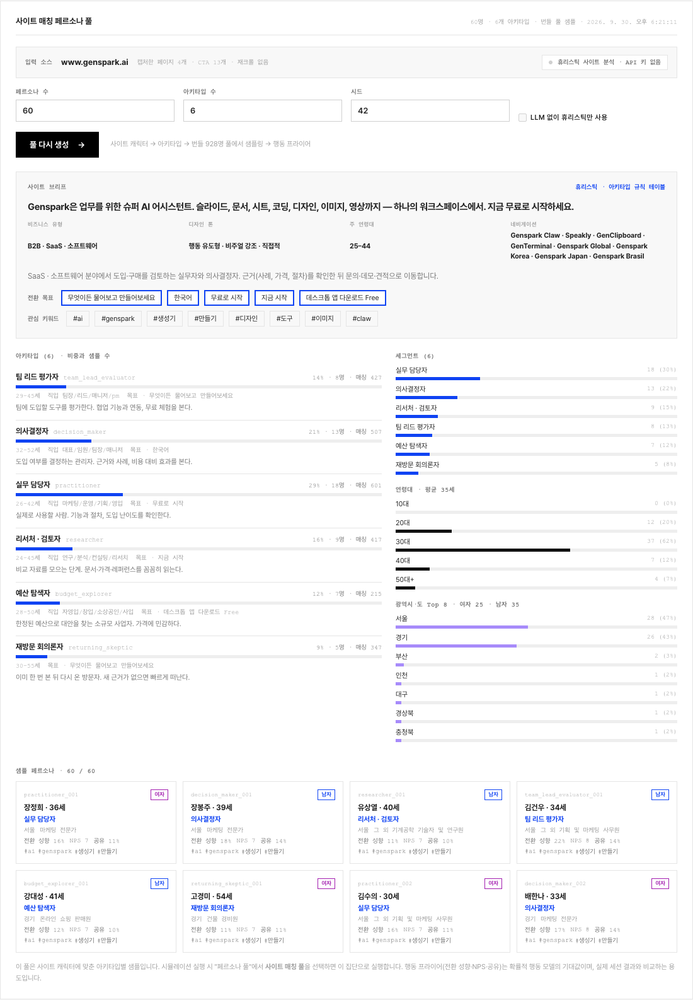
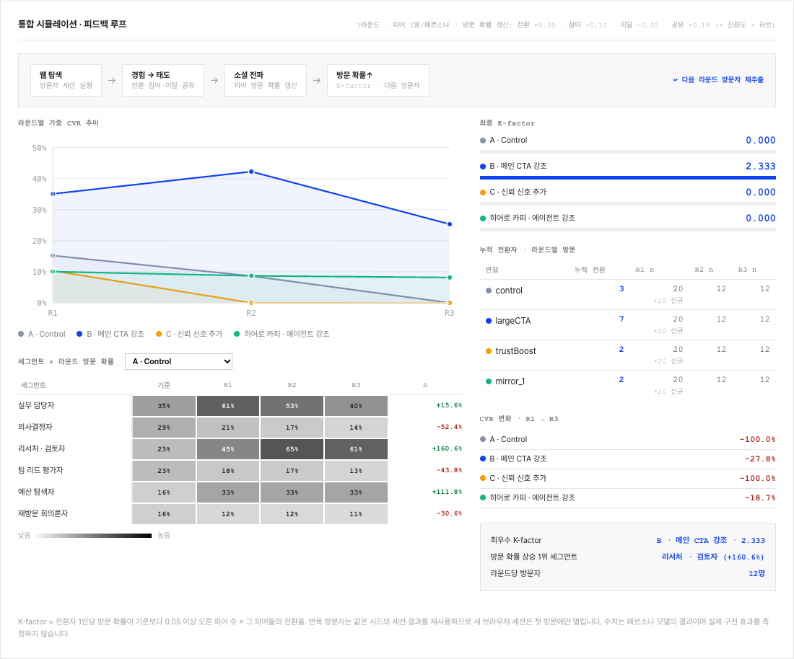
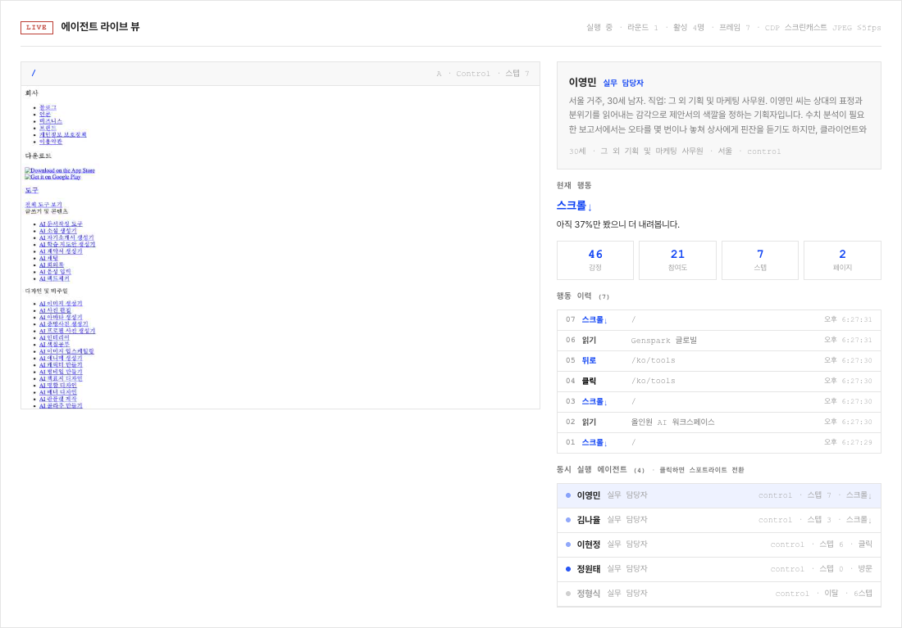
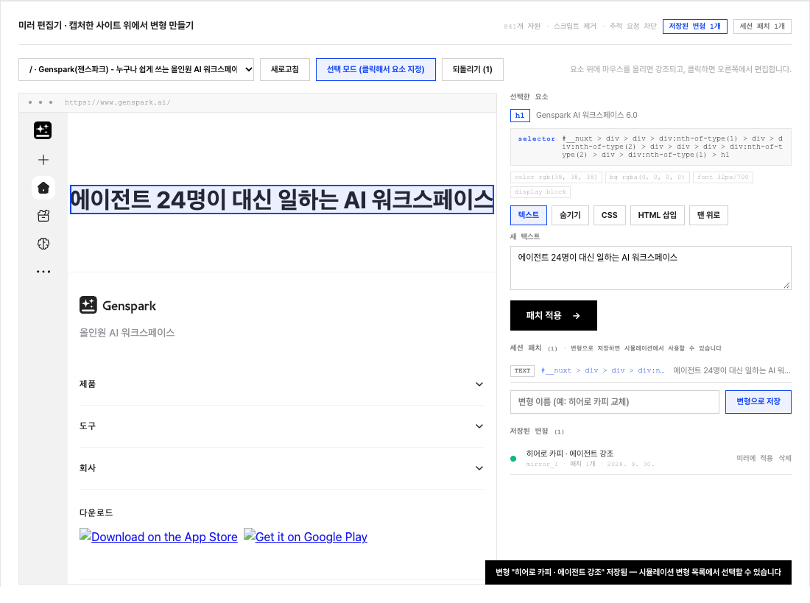
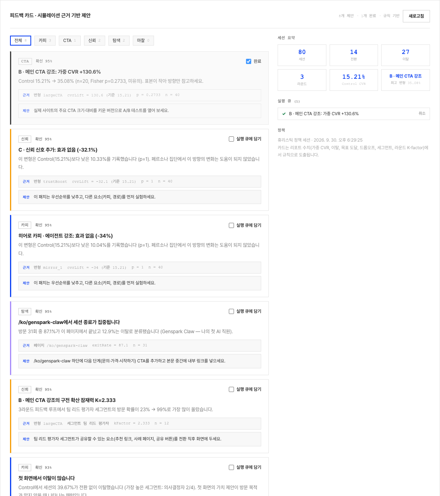

<h1 align="center">MarketClaw</h1>

<p align="center">
  <a href="https://github.com/yc9954/MarketClaw/actions/workflows/ci.yml"></a>
  
  
  
  <a href="LICENSE"></a>
</p>

<p align="center">
  <strong>Make your next marketing decision with evidence, not guesses.</strong><br/>
  MarketClaw is a locally run web app that opens a real website in Playwright Chromium, records a HAR and a full-page<br/>
  screenshot, replays three visitor paths from that recording, and turns what it observed into a report of findings,<br/>
  each with the evidence behind it and a suggested next action. On top of that recording it runs a population of<br/>
  site-matched persona agents against design variants, in feedback-loop rounds, with a live agent view, a mirror<br/>
  editor for building variants and feedback cards derived from the results, all labelled as simulation, never as measurement.
</p>

<h3 align="center"><a href="#getting-started"><ins>Getting started</ins></a></h3>

<p align="center">
  
</p>

## Features

<table>
<tr>
<td width="50%" valign="middle">

### One report, four numbers, every finding traceable

The integrated report shows pages inspected, paths replayed, above-the-fold CTAs and tracking requests blocked, next to the landing page as the browser actually saw it and the list of improvement findings.

The screenshots on this page are an example run against the public [Genspark homepage](https://www.genspark.ai/); counts and page content change over time.

</td>
<td width="50%">
  
</td>
</tr>
<tr>
<td width="50%" valign="middle">

### Inspect pages in a real browser

Playwright Chromium opens the landing page at 1440 × 900 and follows same-origin links, up to four pages by default (eight at most). For each page it records the title, meta description, H1/H2 headings, visible calls to action or standalone prompt inputs, links, form field counts and the HTTP status.

The **HAR Capture** view shows the full-page PNG and the inventory of pages it visited.

</td>
<td width="50%">
  
</td>
</tr>
<tr>
<td width="50%" valign="middle">

### Findings with evidence and a next step

Rules in `analyze.js` flag a missing meta description or H1, no CTA in the initial viewport, pages that errored or returned 4xx/5xx, forms with more than five fields, and failed network requests. Each finding carries the observation that triggered it and one concrete action.

If nothing trips, the report says so, states how many pages were explored and how many preset paths reached their target, and suggests checking paths that match the site's real visit purposes.

</td>
<td width="50%">
  
</td>
</tr>
<tr>
<td width="50%" valign="middle">

### Persona simulation, complete

On top of the recording, a population of persona agents browses the captured site under design variants and the report compares them: weighted conversion, bounce, engagement, Fisher's exact test against control and a drop-off map. The simulation never touches the live site.

Around that core, five pieces complete the picture: **site-matched persona generation** from the run's own page inventory, a **multi-round feedback loop** in which session outcomes change who visits next, a **live agent's-eye view** streamed while sessions run, a **mirror editor** for building variants visually on the captured page, and **feedback cards** with an action queue derived from the results. Every piece has a key-free path and runs in CI.

Details, endpoints and limits are in [Persona simulation](#persona-simulation) below.

</td>
<td width="50%">
  
</td>
</tr>
</table>

---

## Persona simulation

The captures on this page are an example taken from the same Genspark run as the report screenshots; the numbers in them are simulation output, not measurements of real visitors.

<table>
<tr>
<td width="50%"></td>
<td width="50%"></td>
</tr>
<tr>
<td valign="top"><sub><strong>Setup.</strong> Choose the default pool or the site-matched pool generated for this run, the persona count, steps, seed, the number of feedback-loop rounds and visitors per round, and the variants, including the ones saved from the mirror editor. The policy pill says whether an LLM key is configured. Control is always included.</sub></td>
<td valign="top"><sub><strong>Session view.</strong> Every step records the action, its target, the page, the persona's reason, sentiment, engagement and simulated elapsed time, and optionally the viewport screenshot. Sessions are listed control first, then each variant in the order requested.</sub></td>
</tr>
</table>

**What happens when you press start**

1. **Population.** Either the bundled pool (`personas.js` loads `server/data/personas.json`, 928 personas in 10 segments, see [provenance](server/data/PERSONAS-SOURCE.md)) or the pool generated for this run (`poolSource: "generated"`, see [Site-matched personas](#a-site-matched-personas)). The count is split across segments in proportion to their weight, then a seeded shuffle picks inside each segment. The same `seed` always yields the same population.
2. **Variants.** `variants.js` turns each variant into DOM patches (`css`, `text`, `hide`, `inject`, `reorder`) that are applied after every page load. The four defaults are generic and bind to the run's own inventory: `control`, `largeCTA` (enlarges the primary above-the-fold CTA the capture detected), `trustBoost` (a neutral social-proof badge under that CTA, a placeholder you are meant to replace with a real claim), `contactFirst` (a contact bar at the top linking to the contact page found in the capture). Variants saved from the [mirror editor](#d-mirror-editor) are referenced by key; custom variants can also be posted inline as `{ key, name, patches }`. Selectors, text and HTML are length-capped and scripts or inline handlers are rejected.
3. **Shadow browser.** `shadow.js` opens one Playwright context per session and routes it from the run's `capture.har.zip`. Anything the HAR does not contain is answered locally: tracker hosts and foreign origins are aborted, `POST`/`PUT`/`PATCH` to the target origin get a mock `{ ok: true }`, unrecorded documents get a placeholder page. **The live site is never contacted.** An init script intercepts `dataLayer`, `gtag` and `fbq` and records clicks and form submits.
4. **Agents.** `engine.js` observes the page (text, links, buttons, inputs, social proof) and scores every element's visual salience from fold position, F-pattern quadrant, hierarchy, contrast, Fitts's law, Hick's law and Gestalt cues. The persona then picks one action from a four-layer taxonomy (navigation, DOM, micro-signals like `read`/`dwell`, intent like `bounce`/`save_intent`), and memory tracks sentiment, engagement and information scent per step. While a session runs, its page can be watched in the [live view](#c-live-agents-eye-view).
5. **Rounds.** With `rounds` above one, `propagation.js` turns the sessions into a [feedback loop](#b-multi-round-feedback-loop): each outcome updates the visit probability of the persona's peers, and the next round's visitors are drawn from those probabilities.
6. **Goals.** A page counts as a goal page when its path or title matches `contact|pricing|price|plans|signup|estimate|quote|demo|문의|견적|가입|상담|요금|가격|구독|신청`, or the request's own `goals` patterns. A session **converts** when it submits a form or clicks a CTA while already on a goal page; merely reaching a goal page counts as "goal reached", which the report shows separately.
7. **Report.** `report.js` aggregates weighted conversion and bounce (persona weights), engagement, steps, time-to-convert, a drop-off map per path, Fisher's exact test of each variant against control with relative lift, a segment × variant table, the per-round series (weighted CVR, visit probability per segment, K-factor) and a peer-propagation estimate. `feedback.js` then derives the [feedback cards](#e-feedback-cards).

### A. Site-matched personas

<table>
<tr>
<td width="50%" valign="top">

**What it does.** Builds a persona population that fits the analysed site instead of the bundled, site-agnostic pool. The panel shows the input source (the run's own page inventory, no re-crawl), a generate button with stage progress, the site brief, the archetype list with shares and sample counts, the segment / age / region distributions and sample persona cards with their behaviour priors.

**How it works.** `personaGen.js` ports the prototype's recon → site context → archetypes → Nemotron sampler → behaviour model pipeline:

1. *Site character.* What the site sells, for whom, in what tone, with which conversion goals. With `LLM_API_KEY` the character is asked from the OpenAI-compatible endpoint as JSON and validated field by field; without a key it comes from keyword, CTA and title analysis with an industry detector (SaaS, commerce, agency, education, finance, health, travel, real estate, media, recruiting).
2. *Archetypes.* Visitor archetypes with shares, demographic filters, traits, interest keywords and a conversion goal. LLM-derived when a key is set (strict JSON validation, shares normalized), otherwise from a rule table keyed on the detected industry and B2B/B2C lean.
3. *Sampling.* Real people per archetype, either from the bundled 928-persona pool by archetype-to-segment affinity plus demographic match, or from a local export of Nemotron-Personas-Korea when `NEMOTRON_PERSONAS_PATH` is set, with progressive filter relaxation (hobbies → occupation → categories → sex → age) so every archetype fills its quota.
4. *Behaviour priors.* Expected conversion propensity, engagement, sentiment, NPS and share propensity per persona from the probabilistic behaviour model, stored next to the persona and shown against the session outcome.

Generation is deterministic from `seed`; a failed LLM call falls back to the heuristic step and says so in the pool's `warnings`.

**Endpoints.** `POST /api/runs/:id/personas` (`count` 5–300, `archetypes` 3–9, `seed`, `policy: "heuristic"`), `GET /api/runs/:id/personas/status`, `GET /api/runs/:id/personas`. The pool is saved as `data/runs/<id>/personas.json`; `POST /api/runs/:id/simulation` accepts `poolSource: "generated" | "default"`.

**Env.** `LLM_API_KEY` / `LLM_BASE_URL` / `LLM_MODEL` for the LLM path; `NEMOTRON_PERSONAS_PATH`, `NEMOTRON_MAX_ROWS` for the local sampler.

**Limits.** The heuristic character is only as good as the captured titles, headings and CTAs; archetypes from the rule table are generic per industry; the bundled sampler relabels existing personas, so their descriptions still come from the original pool.

</td>
<td width="50%">
  
</td>
</tr>
</table>

**Using the real Nemotron dataset.** The dataset is not bundled. Export it once to JSONL (the product itself has no Python runtime; this is a one-off outside it):

```bash
pip install datasets
python -c "from datasets import load_dataset; load_dataset('nvidia/Nemotron-Personas-Korea', split='train').to_json('nemotron-personas-korea.jsonl', force_ascii=False)"
NEMOTRON_PERSONAS_PATH=/path/to/nemotron-personas-korea.jsonl npm start
```

The sampler streams the file, keeps only the fields it filters on (age, sex, education, province, district, occupation, hobbies, professional persona) and reads at most `NEMOTRON_MAX_ROWS` rows. A `.parquet` path is rejected with a message pointing here.

### B. Multi-round feedback loop

<table>
<tr>
<td width="50%">
  
</td>
<td width="50%" valign="top">

**What it does.** Runs the simulation in rounds. Round 1 exposes the whole sampled population; each session outcome updates the visit probability of the persona's peers; the next round's visitors are drawn from the updated probabilities. The panel shows the loop stages, a round-by-round weighted CVR chart per variant (inline SVG, no chart library), a segment × round visit-probability heatmap with the base column and the final delta, the final K-factor per variant, cumulative converters and the CVR change from the first to the last round.

**How it works.** `propagation.js` ports `integrated_engine.js` and `social_propagation.js`. Each persona gets up to five peers ranked by weight × segment affinity (an affinity table for the bundled segments, 1 / 0.3 otherwise). The update is additive and clipped to [0.01, 0.99]: conversion +0.35 × affinity × hub factor, high engagement +0.12 × affinity, bounce −0.05 × affinity, share intent +0.18 × affinity, where the hub factor (0.5–1.5) makes heavier personas count more. K-factor = referred peers per converter × conversion rate among referred peers, a peer counting as referred when its probability rose more than 0.05 above its segment base. Repeat visitors reuse their own session (the heuristic policy is seeded per persona × variant), so only first-time visits open a browser. Everything is deterministic from `seed`.

**Endpoints.** `POST /api/runs/:id/simulation` takes `rounds` (1–5, default 1) and `visitorsPerRound` (default: the persona count); `GET /api/runs/:id/simulation` returns `report.rounds: [{ round, n, cvrByVariant, visitProbBySegment, kFactor, converters, cumulativeConverters, newSessions }]`, `report.baseVisitProb` and `report.segmentDeltaPct`.

**Limits.** The propagation constants are the prototype's, not fitted to any data; with a small population the probabilities saturate within a few rounds, and the K-factor is a comparison device between variants, not a growth forecast.

</td>
</tr>
</table>

### C. Live agent's-eye view

<table>
<tr>
<td width="50%" valign="top">

**What it does.** While a simulation runs, the spotlighted session is streamed live: the page as the agent sees it, the persona card, the current action with the persona's reason, sentiment, engagement, step and page counters, the action history, and the list of concurrently running agents. Clicking an agent moves the spotlight; the other sessions keep running headless. When nothing runs the panel says so, and after the run it keeps the last frame.

**How it works.** `live.js` ports `browser_server.js` onto the simulation itself. The runner registers every session's page with a per-simulation hub; the hub opens a CDP session on the spotlighted page and calls `Page.startScreencast` (JPEG, quality 50, at most 960 px wide) and throttles frames to five per second. Frames, state, step and completion events go out as server-sent events (base64 JPEG in JSON), which need no extra dependency and work through the Vite proxy. The hub exists from the moment the simulation is queued, so a viewer can subscribe before the first session opens, and the last frame is replayed to late subscribers. When the spotlighted session ends the hub moves to the next running one.

**Endpoints.** `GET /api/runs/:id/simulation/live` (SSE: `state`, `frame`, `step`, `done`, `end`), `GET /api/runs/:id/simulation/live/state` (JSON snapshot), `POST /api/runs/:id/simulation/live/spotlight { sessionId }`.

**Env.** `LIVE_FPS` (5), `LIVE_JPEG_QUALITY` (50), `LIVE_MAX_WIDTH` (960).

**Limits.** One screencast at a time (the spotlight); frames are not stored, only the per-step PNGs from `captureSteps` are. The stream is Chromium-only, like the rest of the capture.

</td>
<td width="50%">
  
</td>
</tr>
</table>

### D. Mirror editor

<table>
<tr>
<td width="50%">
  
</td>
<td width="50%" valign="top">

**What it does.** Serves the captured landing page (and the other recorded pages) from the run's HAR, same-origin with the UI, inside an iframe with an editing overlay. Hover highlights an element, click selects it; the sidebar shows the generated selector and computed style, and offers the five patch types: edit text, hide, change CSS, inject HTML after, move to top. Patches apply immediately in the mirror, can be undone one by one (also Ctrl/⌘+Z), pile up as session patches, and "save as variant" stores them on the run. Saved variants appear in the simulation form with a badge and can be previewed in the mirror again.

**How it works.** `har.js` reads the zipped HAR with a small ZIP reader (stored and deflated entries, no extra dependency) and indexes the recorded responses by URL. `mirror.js` rewrites each HTML and CSS document: scripts, `<noscript>`, iframes, inline event handlers and `javascript:` links are removed, every URL is routed back through the mirror (same-origin paths directly, recorded foreign assets through `__ext/`), a `<base>` is injected, and a strict `Content-Security-Policy` (`script-src 'none'`, `connect-src 'none'`, `default-src 'self'`) blocks anything the HAR does not contain, trackers included. Because the mirror is same-origin, the editor works on the iframe's DOM directly; the selector generator prefers an `id`, then a stable data attribute, then an `nth-of-type` path. Saved variants are validated like custom variants and applied in the shadow browser through the same patch engine.

**Endpoints.** `GET /api/runs/:id/mirror/` (and any recorded path under it), `GET /api/runs/:id/mirror-pages`, `GET /api/runs/:id/variants`, `POST /api/runs/:id/variants { name, patches }` (up to 20 per run, keys `mirror_N` when omitted), `DELETE /api/runs/:id/variants/:key`.

**Limits.** The mirror is the recorded HTML without scripts, so client-rendered content that only exists after JavaScript ran is missing, and unrecorded assets stay blank; the rewriting is regex-based and can miss unusual URL forms. Patch text replaces the element's first text node, which keeps nested markup intact but also means a heading with inline children changes only its first run of text.

</td>
</tr>
</table>

### E. Feedback cards

<table>
<tr>
<td width="50%" valign="top">

**What it does.** After a simulation, turns the report into feedback cards: a session summary, and for each card a category (copy / CTA / trust / navigation / friction), the evidence that produced it (which segment, variant or page, with the metric, value, baseline and sample size), a suggested action and a confidence. Cards can be filtered by category and checked into an action queue that is stored per run.

**How it works.** `feedback.js` is rule-based and deterministic. Rules cover the first-impression bounce on control, every variant's lift against control (typed by what the variant touches), reaching the goal page without converting (with the goal page's form size from the capture), exit concentration per path, the segment gap, agent interaction errors, long paths to conversion, pricing-page hesitation and, with rounds, the word-of-mouth potential of the best K-factor or its absence. Confidence grows with the sample size and the effect size and is capped at 95. With `LLM_API_KEY`, `?refine=1` lets the LLM rewrite title, description and action while ids and evidence stay as derived; without a key, or when the call fails, the rule text stands.

**Endpoints.** `GET /api/runs/:id/simulation/feedback[?refine=1]` returns `{ summary, cards, actions, categories }`; `POST /api/runs/:id/simulation/feedback/actions { id, done, note }` toggles a card in the queue (`data/runs/<id>/feedback-actions.json`).

**Limits.** Cards restate what the simulation did; they are hypotheses to test on the real site, not diagnoses of real visitors. Thresholds are fixed and small samples produce low-confidence cards.

</td>
<td width="50%">
  
</td>
</tr>
</table>

**Decision policy**

| Policy | When | Behaviour |
| --- | --- | --- |
| `heuristic` | default, no key needed | Weighted choice over the observed elements: CTA response, patience, copy importance, price consciousness and social-proof sensitivity from the persona, salience from the page, a commitment gate driven by sentiment. Seeded, so a run is reproducible from `seed`. Used in CI. |
| `llm` | `LLM_API_KEY` is set | Each step asks an OpenAI-compatible chat-completions endpoint (`LLM_BASE_URL`, `LLM_MODEL`) for one JSON action, with the persona, its cognitive profile and the captured page list in the system prompt. A failed call falls back to the heuristic for that step and marks it. |

The same key also switches persona generation (site character and archetypes) and feedback-card refinement to the LLM; each of those validates the JSON it gets back and falls back to its heuristic path otherwise. The policy that ran is stored in every session and in `GET /api/runs/:id/simulation`.

**API**

| Request | Description |
| --- | --- |
| `GET /api/personas` | Bundled pool summary (segments with counts and weights, sample personas), default variants, limits, generation defaults and LLM status. |
| `POST /api/runs/:id/personas` | Generate the site-matched pool for a completed run. Body: `count` (5–300, default 60), `archetypes` (3–9, default 6), `seed`, `policy: "heuristic"`. `202` with the job; `409` while a generation runs. |
| `GET /api/runs/:id/personas/status` | `status`, `stage` (`site_context`, `archetypes`, `sampling`, `done`), `detail`, `error`. |
| `GET /api/runs/:id/personas` | The generated pool: site character, archetypes with sample counts, sampling stats, distributions and personas (first 60 by default, `?limit=`). |
| `POST /api/runs/:id/simulation` | Start a simulation for a completed run. Body: `personas` (1–200, default 20), `poolSource` (`default` \| `generated`), `segments`, `variants` (default keys, saved keys or custom objects), `goals` (path patterns), `rounds` (1–5), `visitorsPerRound`, `concurrency` (1–6), `maxSteps` (2–30), `captureSteps`, `seed`, `policy: "heuristic"`. `409` if the run is not completed, a simulation is already running, or the generated pool is missing. |
| `GET /api/runs/:id/simulation` | `status`, `progress { done, total, failed, round, rounds }`, `policy`, `params`, `site`, `pool`, `report` (including `rounds`) and session summaries. |
| `GET /api/runs/:id/simulation/sessions/:sid` | One session's full step log, memory, shadow events and network stats. |
| `GET /api/runs/:id/simulation/sessions/:sid/steps/:n.png` | The viewport at step `n` when `captureSteps` was on (up to 8 per session). |
| `GET /api/runs/:id/simulation/live` | Server-sent events for the running simulation: `state`, `frame` (base64 JPEG), `step`, `done`, `end`. Idle when nothing runs. |
| `GET /api/runs/:id/simulation/live/state` | JSON snapshot of the live hub. |
| `POST /api/runs/:id/simulation/live/spotlight` | Move the screencast to another running session. |
| `GET /api/runs/:id/mirror/` | The captured site served from the HAR, scripts stripped, CSP-locked; any recorded path works under it. |
| `GET /api/runs/:id/mirror-pages` | Recorded pages and the number of indexed assets. |
| `GET` / `POST /api/runs/:id/variants`, `DELETE /api/runs/:id/variants/:key` | Variants saved on the run. |
| `GET /api/runs/:id/simulation/feedback` | Feedback cards, summary and the action queue; `?refine=1` for LLM wording. |
| `POST /api/runs/:id/simulation/feedback/actions` | Toggle a card in the action queue. |

Simulations share the API's one-job-at-a-time queue with captures; persona generation runs beside it. Results are written to `data/runs/<id>/simulation/` (`sessions/*.json`, `screenshots/<session>/step_NN.png`, `report.json`), `simulation.json`, `personas.json`, `variants.json` and `feedback-actions.json`, so they survive a restart; a simulation interrupted by a restart is marked `interrupted`.

**Limits, stated plainly**

- **Simulated, not measured.** Every conversion rate, bounce rate, lift, p-value, visit probability and K-factor describes what persona agents did inside a recording. They are inputs to the next experiment, not evidence about real visitors.
- **The pools are illustrative.** The bundled pool was sampled from NVIDIA's Nemotron-Personas-Korea for a Korean B2B pop-up-store agency site; the site-matched pool re-samples it (or a local export) by archetype, and its archetypes are heuristic or LLM guesses about who visits. Bring your own pool with `PERSONA_POOL_PATH` for a different audience.
- **Only the recording exists.** Agents, the mirror and the live view can only show pages the capture recorded (up to `MAX_PAGES`); other links open a placeholder. Form posts are mocked. JavaScript-heavy sites replay only as well as their HAR does, and the mirror shows them without scripts.
- **The heuristic policy is a model of attention, not of people.** It reacts to salience, keywords and a few persona traits. Small populations produce wide swings; Fisher's test reports that honestly with high p-values, and the feedback cards carry a confidence for the same reason.

---

## How it works

```text
Vue UI (web/) ──POST /api/runs──▶ Express API (server/src/index.js)
                                     │  one run at a time, progress events per run
                                     ▼
                              browser.js
                                ├─ URL + private-network validation
                                ├─ Playwright Chromium (headless by default), 1440×900, recordHar, tracker routes blocked
                                ├─ landing page + same-origin crawl (MAX_PAGES)
                                ├─ full-page PNG + HAR → data/runs/<id>/
                                └─ offline replay of 3 visitor paths from the HAR
                                     ▼
                              analyze.js  ── rule-based findings ──▶ JSON result ──▶ GET /api/runs/:id ──▶ report view
                                     │
        ┌────────────────────────────┼──────────────────────────────┐
        ▼                            ▼                              ▼
POST /api/runs/:id/personas   POST /api/runs/:id/simulation   GET /api/runs/:id/mirror/
simulation/personaGen.js      (same queue as captures)        simulation/har.js + mirror.js
  site character (heuristic|llm)  simulation/runner.js              HAR → same-origin page, scripts
  archetypes (rules|llm)            ├─ personas.js: default or generated pool, seeded sample   stripped, CSP-locked
  bundled / Nemotron sampler        ├─ shadow.js: one context per session, routed from capture.har.zip only
  behaviour priors                  ├─ variants.js: default, saved (mirror editor) and custom patches
  → data/runs/<id>/personas.json    ├─ engine.js: observe → decide (heuristic | llm) → act → memory, per step
                                    ├─ live.js: CDP screencast of the spotlighted session → SSE /simulation/live
                                    ├─ propagation.js: rounds, peer visit-probability updates, K-factor
                                    └─ report.js: weighted CVR/BR, Fisher's exact, drop-off, segments, rounds
                                                         │
                                                         ▼
                                    simulation/feedback.js ── cards + action queue ──▶ GET /simulation/feedback
```

1. **Submit.** The home screen posts `{ "url": "https://example.com" }`. Only HTTP(S) URLs are accepted; local and private-network targets are rejected unless `ALLOW_PRIVATE_TARGETS=1`, and cross-origin redirects are treated as errors.
2. **Capture.** A separate browser context (never your signed-in browser) records a HAR with embedded content, blocks known tracking hosts, and inspects the landing page plus same-origin links.
3. **Replay.** A second context replays the three purpose-driven paths from the HAR, counting which ones reached their target.
4. **Analyze and store.** `analyze.js` turns page properties, network failures and replay results into findings. The result is written to `data/runs/` and streamed to the UI as progress events.
5. **Simulate.** From the completed run: generate a site-matched pool, build variants in the mirror, run the simulation in rounds while watching the live view, then read the report and the feedback cards. Each step is described under [Persona simulation](#persona-simulation).

| Request | Description |
| --- | --- |
| `GET /api/health` | Service health, version, LLM status and the feature list. |
| `POST /api/runs` | Start an asynchronous run; returns a run id. |
| `GET /api/runs` | List runs, newest first. |
| `GET /api/runs/:id` | Progress events and the report. |
| `GET /api/runs/:id/screenshot` | The landing-page PNG of a completed run. |
| `GET /api/personas` | Bundled persona pool summary, default variants, limits and LLM status. |
| `POST` / `GET /api/runs/:id/personas`, `GET /api/runs/:id/personas/status` | Site-matched persona generation. |
| `POST` / `GET /api/runs/:id/simulation` | Start a persona simulation on a completed run; status, progress, report (with rounds) and session summaries. |
| `GET /api/runs/:id/simulation/sessions/:sid`, `…/steps/:n.png` | Full step log of one session; viewport screenshot at step `n`. |
| `GET /api/runs/:id/simulation/live`, `…/live/state`, `POST …/live/spotlight` | Live agent's-eye view. |
| `GET /api/runs/:id/mirror/`, `GET /api/runs/:id/mirror-pages` | The captured site served from the HAR for the mirror editor. |
| `GET` / `POST /api/runs/:id/variants`, `DELETE /api/runs/:id/variants/:key` | Variants saved on the run. |
| `GET /api/runs/:id/simulation/feedback`, `POST …/feedback/actions` | Feedback cards and the action queue. |

If the server restarts mid-run, that run is marked `interrupted`; start a new one. The same applies to a simulation.

---

## Tech stack

<p>
  <kbd>Vue&nbsp;3.5</kbd> &nbsp; <kbd>vue-router&nbsp;4</kbd> &nbsp; <kbd>Vite&nbsp;7</kbd> &nbsp; <kbd>Phosphor&nbsp;icons</kbd> &nbsp;
  <kbd>Node&nbsp;≥&nbsp;20</kbd> &nbsp; <kbd>Express&nbsp;4</kbd> &nbsp; <kbd>Playwright&nbsp;1.58</kbd> &nbsp; <kbd>dotenv</kbd> &nbsp; <kbd>npm&nbsp;workspaces</kbd> &nbsp; <kbd>node:test</kbd>
</p>

No other runtime dependencies were added for the simulation features: the ZIP/HAR reader, the SSE stream and the SVG chart are written against Node and the browser directly.

---

## Getting started

**Prerequisites**

- Node.js 20 or newer and npm.
- An environment where Playwright can install Chromium. On macOS you may set `BROWSER_CHANNEL=chrome` to use an installed Google Chrome instead.

```bash
git clone https://github.com/yc9954/MarketClaw.git
cd MarketClaw
npm ci
npx playwright install chromium
cp .env.example .env
npm run dev            # Vue dev server on :3000 + API on :4000, stopped together
```

Open <http://127.0.0.1:3000> and enter a public website URL.

**Analyze a site that blocks headless browsers.** Genspark's security checks may reject an automated headless browser; the screenshots above were captured on macOS with an installed Chrome in visible mode:

```bash
BROWSER_CHANNEL=chrome BROWSER_HEADLESS=0 PAGE_SETTLE_MS=5000 npm run dev
```

A Chrome window opens while the run is active. Site security checks and the visible page can vary by machine and session.

**Try the local fixture:** `npm run dev:demo` starts `demo-site/` as well and allows private-network targets for that process; then enter `http://127.0.0.1:4175/` in the app. (Both commands use macOS/Linux shell syntax.)

**Single-server build:**

```bash
npm run build          # vite build → web/dist
npm start              # Express serves the built UI and the API on :4000
```

| Process | Port | Notes |
| --- | --- | --- |
| Vue dev server (`npm run dev -w web`) | `3000` | bound to `127.0.0.1` |
| Express API + built UI (`npm start`) | `4000` | `HOST` / `PORT` |
| Bundled demo site (`npm run demo:site`) | `4175` | `DEMO_PORT` |

| Variable | Default | Purpose |
| --- | --- | --- |
| `HOST` | `127.0.0.1` | API bind address. |
| `PORT` | `4000` | API and built-UI port. |
| `BROWSER_CHANNEL` | empty | Empty uses Playwright's Chromium; `chrome` uses installed Google Chrome. |
| `BROWSER_HEADLESS` | `1` | Set to `0` to open a visible browser window during the run. |
| `PAGE_SETTLE_MS` | `750` | Wait after `domcontentloaded` before extracting a page (0–10000). |
| `MAX_PAGES` | `4` | Same-origin pages inspected per run; capped at 8. |
| `ALLOW_PRIVATE_TARGETS` | `0` | Allow local and private-network URLs. Only for the local fixture and tests. |
| `DATA_DIR` | `data/runs` | Where run results are written. |
| `DEMO_PORT` | `4175` | Bundled demo-site port. |
| `LLM_API_KEY` | empty | Enables the `llm` decision policy, LLM persona generation and feedback refinement. Empty means the heuristic paths. |
| `LLM_BASE_URL` | `https://api.openai.com/v1` | OpenAI-compatible chat-completions base URL (OpenAI, OpenRouter, a local server). |
| `LLM_MODEL` | `gpt-4o-mini` | Model name sent to that endpoint. |
| `SIM_CONCURRENCY` | `3` | Parallel browser sessions per simulation (1–6). |
| `SIM_MAX_STEPS` | `12` | Steps per session (2–30). |
| `PERSONA_POOL_PATH` | empty | Path to a custom bundled-style persona pool JSON; empty uses `server/data/personas.json`. |
| `NEMOTRON_PERSONAS_PATH` | empty | Path to a local JSONL export of Nemotron-Personas-Korea for site-matched sampling; empty samples from the bundled pool. |
| `NEMOTRON_MAX_ROWS` | `50000` | Rows read from that export. |
| `LIVE_FPS` | `5` | Upper bound of screencast frames per second in the live view. |
| `LIVE_JPEG_QUALITY` | `50` | JPEG quality of the screencast. |
| `LIVE_MAX_WIDTH` | `960` | Maximum frame width in pixels. |

---

## Building and testing

```bash
npm test               # builds the UI, then node --test server/test/*.test.js
```

`integration.test.js` starts a local fixture server from `demo-site/` and checks real browser capture, HAR replay, findings, PNG delivery, opening a result from the home screen, and the visual layout. `simulation.test.js` unit-tests Fisher's exact test against known tables, weighted conversion, seeded persona sampling, variant patches on a static page and goal detection, then captures the demo site and runs a small simulation through the API with the heuristic policy, checking sessions, report, screenshots, reproducibility of the seed and the simulation tab in the UI. `simulation-complete.test.js` covers the five newer pieces: the heuristic site character, archetypes and both samplers (shape and determinism), the propagation math (visit-probability update, K-factor, rounds, reproducibility), mirror rewriting, feedback derivation and saved-variant resolution, then, against the demo site, generates a pool, serves the mirror, saves a variant, runs a two-persona two-round simulation on the generated pool with that variant while reading the live stream until a screencast frame arrives, checks the feedback cards and action queue, and drives the mirror editor in the UI. No API key is needed. [`.github/workflows/ci.yml`](.github/workflows/ci.yml) runs all three on Node 22 with `BROWSER_CHANNEL=chromium`.

---

## Reading the report

| Metric | Meaning |
| --- | --- |
| Pages inspected | Same-origin pages the browser attempted to open, including ones that returned errors. |
| Paths replayed | Visitor-purpose paths that reached their target from the HAR, out of all attempted. |
| Above-the-fold CTAs | Action elements or standalone prompt inputs visible in the initial 1440 × 900 viewport. Heuristic; may not perfectly separate CTAs from navigation. |
| Tracking requests blocked | Requests matching the built-in analytics/advertising domain list. Not comprehensive tracker detection. |
| Improvement findings | Rule-based checks of captured page properties and errors, meant to guide the next experiment. |
| Weighted CVR / bounce (simulation) | Share of persona weight that converted or bounced per variant. Simulated agents, not visitors. |
| Lift, p-value (simulation) | Relative change of weighted CVR against control and the two-sided Fisher's exact p-value on raw counts. |
| Goal reached (simulation) | Share of sessions that opened a goal page at all; conversion additionally requires a form submit or a CTA click on that page. |
| Visit probability, K-factor (feedback loop) | Per segment and round, the mean probability that a persona visits next round after its peers' outcomes; K-factor is referred peers per converter × their conversion rate. A comparison device between variants, not a growth forecast. |
| Behaviour priors (site-matched pool) | Expected conversion propensity, engagement, sentiment and NPS of a persona under the behaviour model, before any session ran; shown next to what the session actually did. |
| Feedback card confidence | A function of the sample size and the effect size behind the card, capped at 95. |

Check the captured page against the report before acting on a recommendation.

---

## Repository structure

| Path | What lives there |
| --- | --- |
| `server/src/index.js` | Express API, in-memory job queue (one run at a time), local storage under `data/runs/`, live hubs, saved variants, feedback actions, static serving of the built UI. |
| `server/src/browser.js` | URL checks, Playwright capture (HAR, PNG, page inventory, tracker blocking), offline HAR path replay. |
| `server/src/analyze.js` | The finding rules. |
| `server/src/demo.js` | Static server for the bundled demo site. |
| `server/src/simulation/` | Persona simulation: `personas.js` (pools, seeded sampling), `personaGen.js` (site character, archetypes, bundled and Nemotron samplers, behaviour priors), `variants.js` (patch engine, default and saved variants, validation), `shadow.js` (HAR-only browser context), `engine.js` (observation, salience, actions, memory, goals, heuristic and LLM policies), `runner.js` (sessions with concurrency, rounds, live hooks, session files, screenshots), `propagation.js` (peer network, visit-probability updates, K-factor, round orchestration), `live.js` (CDP screencast hub over SSE), `har.js` (ZIP and HAR reader), `mirror.js` (same-origin mirror with rewriting and CSP), `feedback.js` (feedback cards and LLM refinement), `report.js` (aggregation, Fisher's exact test, drop-off, segments, rounds), `llm.js` (JSON calls with repair), `random.js` (seeded PRNG). |
| `server/data/personas.json`, `server/data/PERSONAS-SOURCE.md` | The bundled persona pool and where it came from. |
| `server/test/integration.test.js`, `server/test/simulation.test.js`, `server/test/simulation-complete.test.js` | End-to-end test against the demo site; unit and API tests for the simulation core; unit and API tests for persona generation, the feedback loop, the live view, the mirror and the feedback cards. |
| `web/src/` | Vue app: `views/Home.vue` (URL input, pipeline, recent runs), `views/Report.vue` (report, capture, replay, feedback, simulation tabs), `views/Simulation.vue` (pools, run form, results, session view) with `views/simulation-shared.css`, and `components/` (`PersonaPoolPanel.vue`, `MirrorEditor.vue`, `AgentLiveView.vue`, `FeedbackLoopPanel.vue`, `FeedbackCards.vue`). |
| `demo-site/` | Local fixture for the integration test: `index`, `features`, `pricing`, `contact`. |
| `docs/screenshots/`, `docs/assets/` | Screenshots from one actual Genspark run (capture, report and simulation); `legacy/` keeps captures of the pre-MarketClaw prototype. |
| `data/runs/` | Local run results (git-ignored). |
| `.env.example`, `.github/workflows/ci.yml` | Configuration defaults and CI. |

---

## Project status

**Working today.** Everything above: capture, tracker blocking, HAR replay of three paths, rule-based findings, PNG/HAR/JSON storage, run history, the Korean UI, the persona simulation with its heuristic and LLM policies, site-matched persona generation, the multi-round feedback loop, the live agent view, the mirror editor with saved variants, the feedback cards with an action queue, and CI-backed tests for all of it. Version 1.2.0.

**Security posture.** The API binds to loopback and has no authentication, rate limiting or access control; add those before exposing it beyond your machine. A HAR can contain response bodies, URLs and sometimes cookies or authorization data from the visited site, and the mirror serves that HAR's documents to the browser. MarketClaw uses its own browser context, not your signed-in browser, but keep `data/runs/` private and never commit it.

**Known limitations.** JavaScript errors, bot protection, login walls and network conditions can make pages or replay paths fail; some sites only load in a visible (`BROWSER_HEADLESS=0`) installed Chrome. CTA and tracker detection are heuristics. The server processes a single job (capture or simulation) at a time; on start it reloads previous runs from `data/runs/` and marks any that were in progress as `interrupted`. Simulations, the mirror and the live view only see the pages the capture recorded, the persona pools are illustrative, and the results are simulated (see [Persona simulation](#persona-simulation)).

**Out of scope.** Real-user behaviour, visitor counts, conversion rates or revenue. MarketClaw observes a site and suggests the next experiment; the persona simulation compares design variants under a model of visitors, and its numbers must not be read as measurements.

---

## Credits and license

MarketClaw grew out of an experiment based on [MiroFish](https://github.com/666ghj/MiroFish), with a redesigned scope and implementation. The persona pool is derived from [NVIDIA Nemotron-Personas-Korea](https://huggingface.co/datasets/nvidia/Nemotron-Personas-Korea) (CC BY 4.0); see [`server/data/PERSONAS-SOURCE.md`](server/data/PERSONAS-SOURCE.md). The Genspark name and pages shown in the screenshots belong to their respective owner; MarketClaw is not an official Genspark or OpenClaw product.

Code and documentation are distributed under the [AGPL-3.0](LICENSE).
