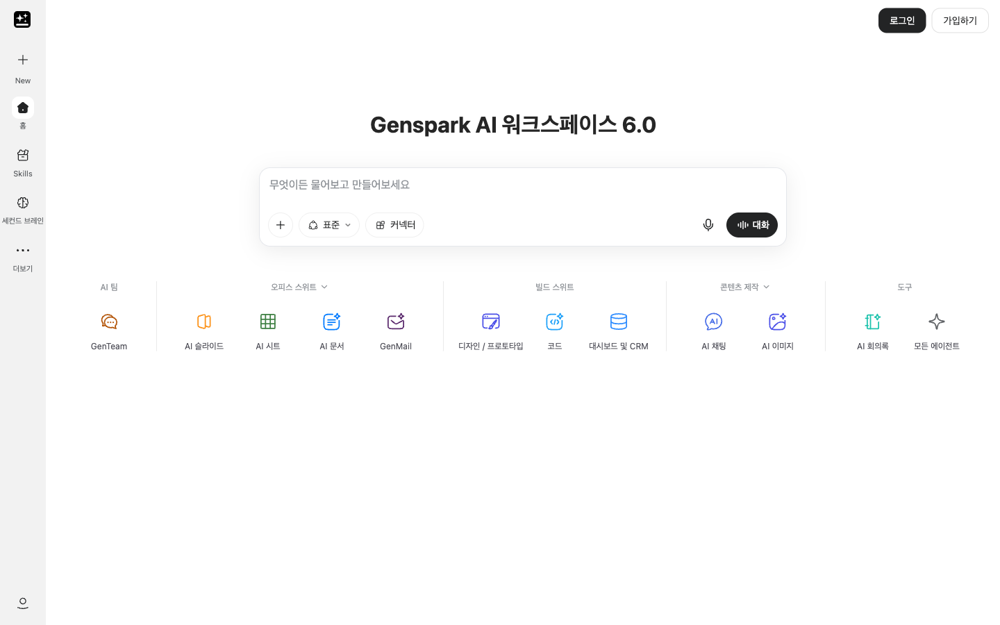
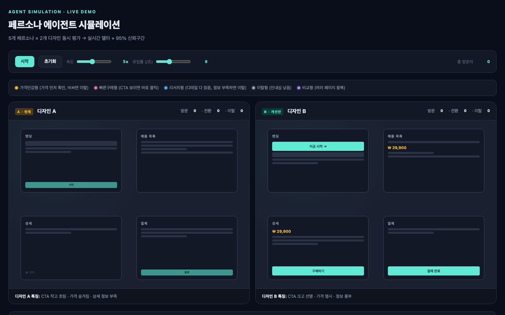
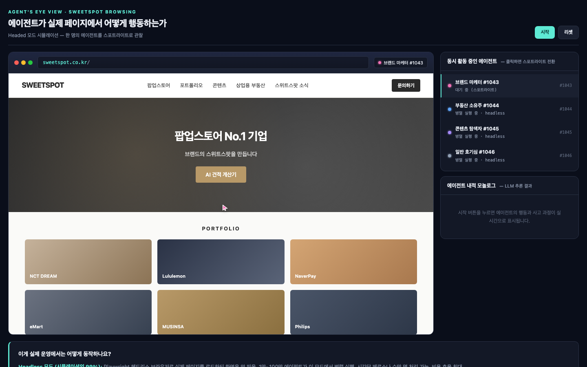
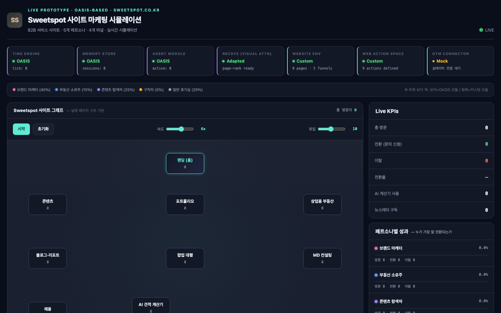
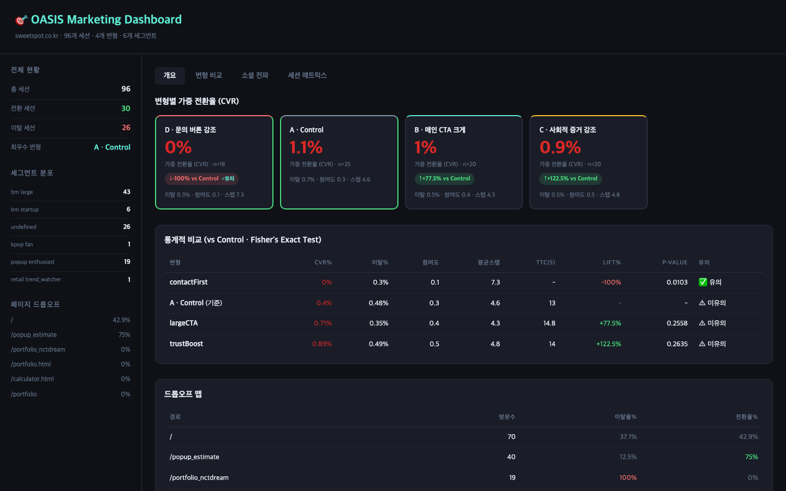

<p align="center">
  
</p>

<h1 align="center">MarketClaw</h1>

<p align="center">
  <a href="https://github.com/yc9954/MarketClaw/actions/workflows/ci.yml"></a>
  
  
  
  <a href="LICENSE"></a>
</p>

<p align="center">
  <strong>Make your next marketing decision with evidence, not guesses.</strong><br/>
  MarketClaw is a locally run web app that opens a real website in Playwright Chromium, records a HAR and a full-page<br/>
  screenshot, replays three visitor paths from that recording, and turns what it observed into a report of findings,<br/>
  each with the evidence behind it and a suggested next action. It never invents conversion rates or revenue.
</p>

<h3 align="center"><a href="#getting-started"><ins>Getting started</ins></a></h3>

<p align="center">
  
</p>

## Features

<table>
<tr>
<td width="50%" valign="middle">

### One report, four numbers, every finding traceable

The integrated report shows pages inspected, paths replayed, above-the-fold CTAs and tracking requests blocked, next to the landing page as the browser actually saw it and the list of improvement findings.

The report shown here came from a real run against the public [Genspark homepage](https://www.genspark.ai/) on 27 September 2026: four pages inspected, one primary interaction visible in the initial viewport, eight tracker requests blocked, and none of the three preset paths found a matching link in Genspark's workspace interface (0/3), which is not a problem with Genspark. Counts and page content change over time.

</td>
<td width="50%">
  
</td>
</tr>
<tr>
<td width="50%" valign="middle">

### Inspect pages in a real browser

Playwright Chromium opens the landing page at 1440 × 900 and follows same-origin links, up to four pages by default (eight at most). For each page it records the title, meta description, H1/H2 headings, visible calls to action or standalone prompt inputs, links, form field counts and the HTTP status.

The **HAR Capture** view shows the full-page PNG and the inventory of pages it visited.

</td>
<td width="50%">
  
</td>
</tr>
<tr>
<td width="50%" valign="middle">

### Findings with evidence and a next step

Rules in `analyze.js` flag a missing meta description or H1, no CTA in the initial viewport, pages that errored or returned 4xx/5xx, forms with more than five fields, and failed network requests. Each finding carries the observation that triggered it and one concrete action.

If nothing trips, the report says so, states how many pages were explored and how many preset paths reached their target, and suggests checking paths that match the site's real visit purposes.

</td>
<td width="50%">
  
</td>
</tr>
<tr>
<td width="50%" valign="middle">

### The page as the browser saw it

This is the public Genspark workspace as captured by MarketClaw in a separate, signed-out browser session: an observed screenshot of the official site, not a recreated page or a mockup. Every run keeps its own full-page PNG next to the HAR.

</td>
<td width="50%">
  
</td>
</tr>
</table>

**Also included**

- **Read-only path replay.** Three visitor purposes (first-time visitor, pricing evaluator, someone about to contact the business) are replayed from the recorded HAR in a fresh browser context. No forms are submitted, no accounts created, no purchases made.
- **Tracker blocking and URL cleaning.** Requests to a built-in list of analytics and advertising domains are blocked, and common tracking query parameters are stripped before capture.
- **Local evidence store.** Every run writes its JSON result, PNG and HAR to `data/runs/<run id>/` (git-ignored). Runs reopen from the home screen.
- **A local fixture site.** `demo-site/` is a small Fieldnote landing site (home, features, pricing, contact) that the integration test runs against, so CI is repeatable without touching a live site.
- **Korean UI.** All screens, findings and progress messages are written in Korean; the language badge in the header is display-only.

---

## Where MarketClaw came from: the multi-agent persona simulation

MarketClaw is the evidence half of a larger prototype. The first version, built on [MiroFish](https://github.com/666ghj/MiroFish), simulated a website's visitors as a **population of persona agents**: a persona pool sampled from NVIDIA's Nemotron-Personas-Korea by site-matched archetype, a probabilistic behaviour model per persona, parallel Playwright agents browsing the real site while one is spotlighted in headed mode, and a dashboard that compared design variants across all sessions with Fisher's exact test. That simulation stage is what these captures show.

<table>
<tr>
<td width="50%"></td>
<td width="50%"></td>
</tr>
<tr>
<td valign="top"><sub><strong>Persona × design simulation.</strong> Five persona types (price-sensitive, fast buyer, researcher, bouncer, comparer) walk two designs of the same funnel at once; visits, conversions and drop-offs accumulate per design with a live delta and confidence interval.</sub></td>
<td valign="top"><sub><strong>Agent's eye view.</strong> One persona is spotlighted in a headed browser on the real site while the rest of the population runs headless; the panel on the right lists the concurrently active agents and streams the spotlighted agent's inner monologue.</sub></td>
</tr>
<tr>
<td width="50%"></td>
<td width="50%"></td>
</tr>
<tr>
<td valign="top"><sub><strong>Site graph simulation.</strong> The real page structure as a graph, a persona mix (brand marketer 40%, property owner 10%, content explorer 25%, job seeker 5%, casual 20%), and OASIS modules for time, memory, agents and recommendation with live KPIs per persona.</sub></td>
<td valign="top"><sub><strong>Variant dashboard.</strong> Sessions from the whole population are aggregated per variant and segment: weighted conversion, bounce, engagement, steps, time to convert, lift against control with a p-value, and a drop-off map per route.</sub></td>
</tr>
</table>

**That stage is not in this repository.** The persona pool, the OASIS-based engine and the variant dashboard live in the earlier MiroFish-based prototype, which was never published. MarketClaw was rebuilt around the part that produces verifiable evidence: a real browser, a HAR, a screenshot and rule-based findings. The captures above were rendered from the prototype's standalone pages for this page; the simulation counters read zero because they show the initial state, and the dashboard numbers come from one recorded run against sweetspot.co.kr.

---

## How it works

```text
Vue UI (web/) ──POST /api/runs──▶ Express API (server/src/index.js)
                                     │  one run at a time, progress events per run
                                     ▼
                              browser.js
                                ├─ URL + private-network validation
                                ├─ Playwright Chromium (headless by default), 1440×900, recordHar, tracker routes blocked
                                ├─ landing page + same-origin crawl (MAX_PAGES)
                                ├─ full-page PNG + HAR → data/runs/<id>/
                                └─ offline replay of 3 visitor paths from the HAR
                                     ▼
                              analyze.js  ── rule-based findings ──▶ JSON result ──▶ GET /api/runs/:id ──▶ report view
```

1. **Submit.** The home screen posts `{ "url": "https://example.com" }`. Only HTTP(S) URLs are accepted; local and private-network targets are rejected unless `ALLOW_PRIVATE_TARGETS=1`, and cross-origin redirects are treated as errors.
2. **Capture.** A separate browser context (never your signed-in browser) records a HAR with embedded content, blocks known tracking hosts, and inspects the landing page plus same-origin links.
3. **Replay.** A second context replays the three purpose-driven paths from the HAR, counting which ones reached their target.
4. **Analyze and store.** `analyze.js` turns page properties, network failures and replay results into findings. The result is written to `data/runs/` and streamed to the UI as progress events.

| Request | Description |
| --- | --- |
| `GET /api/health` | Service health. |
| `POST /api/runs` | Start an asynchronous run; returns a run id. |
| `GET /api/runs` | List runs, newest first. |
| `GET /api/runs/:id` | Progress events and the report. |
| `GET /api/runs/:id/screenshot` | The landing-page PNG of a completed run. |

If the server restarts mid-run, that run is marked `interrupted`; start a new one.

---

## Tech stack

<p>
  <kbd>Vue&nbsp;3.5</kbd> &nbsp; <kbd>vue-router&nbsp;4</kbd> &nbsp; <kbd>Vite&nbsp;7</kbd> &nbsp; <kbd>Phosphor&nbsp;icons</kbd> &nbsp;
  <kbd>Node&nbsp;≥&nbsp;20</kbd> &nbsp; <kbd>Express&nbsp;4</kbd> &nbsp; <kbd>Playwright&nbsp;1.58</kbd> &nbsp; <kbd>dotenv</kbd> &nbsp; <kbd>npm&nbsp;workspaces</kbd> &nbsp; <kbd>node:test</kbd>
</p>

---

## Getting started

**Prerequisites**

- Node.js 20 or newer and npm.
- An environment where Playwright can install Chromium. On macOS you may set `BROWSER_CHANNEL=chrome` to use an installed Google Chrome instead.

```bash
git clone https://github.com/yc9954/MarketClaw.git
cd MarketClaw
npm ci
npx playwright install chromium
cp .env.example .env
npm run dev            # Vue dev server on :3000 + API on :4000, stopped together
```

Open <http://127.0.0.1:3000> and enter a public website URL.

**Analyze a site that blocks headless browsers.** Genspark's security checks may reject an automated headless browser; the screenshots above were captured on macOS with an installed Chrome in visible mode:

```bash
BROWSER_CHANNEL=chrome BROWSER_HEADLESS=0 PAGE_SETTLE_MS=5000 npm run dev
```

A Chrome window opens while the run is active. Site security checks and the visible page can vary by machine and session.

**Try the local fixture:** `npm run dev:demo` starts `demo-site/` as well and allows private-network targets for that process; then enter `http://127.0.0.1:4175/` in the app. (Both commands use macOS/Linux shell syntax.)

**Single-server build:**

```bash
npm run build          # vite build → web/dist
npm start              # Express serves the built UI and the API on :4000
```

| Process | Port | Notes |
| --- | --- | --- |
| Vue dev server (`npm run dev -w web`) | `3000` | bound to `127.0.0.1` |
| Express API + built UI (`npm start`) | `4000` | `HOST` / `PORT` |
| Bundled demo site (`npm run demo:site`) | `4175` | `DEMO_PORT` |

| Variable | Default | Purpose |
| --- | --- | --- |
| `HOST` | `127.0.0.1` | API bind address. |
| `PORT` | `4000` | API and built-UI port. |
| `BROWSER_CHANNEL` | empty | Empty uses Playwright's Chromium; `chrome` uses installed Google Chrome. |
| `BROWSER_HEADLESS` | `1` | Set to `0` to open a visible browser window during the run. |
| `PAGE_SETTLE_MS` | `750` | Wait after `domcontentloaded` before extracting a page (0–10000). |
| `MAX_PAGES` | `4` | Same-origin pages inspected per run; capped at 8. |
| `ALLOW_PRIVATE_TARGETS` | `0` | Allow local and private-network URLs. Only for the local fixture and tests. |
| `DATA_DIR` | `data/runs` | Where run results are written. |
| `DEMO_PORT` | `4175` | Bundled demo-site port. |

---

## Building and testing

```bash
npm test               # builds the UI, then node --test server/test/*.test.js
```

The integration test starts a local fixture server from `demo-site/` and checks real browser capture, HAR replay, findings, PNG delivery, opening a result from the home screen, and the visual layout. [`.github/workflows/ci.yml`](.github/workflows/ci.yml) runs the same test on Node 22 with `BROWSER_CHANNEL=chromium`.

---

## Reading the report

| Metric | Meaning |
| --- | --- |
| Pages inspected | Same-origin pages the browser attempted to open, including ones that returned errors. |
| Paths replayed | Visitor-purpose paths that reached their target from the HAR, out of all attempted. |
| Above-the-fold CTAs | Action elements or standalone prompt inputs visible in the initial 1440 × 900 viewport. Heuristic; may not perfectly separate CTAs from navigation. |
| Tracking requests blocked | Requests matching the built-in analytics/advertising domain list. Not comprehensive tracker detection. |
| Improvement findings | Rule-based checks of captured page properties and errors, meant to guide the next experiment. |

Check the captured page against the report before acting on a recommendation.

---

## Repository structure

| Path | What lives there |
| --- | --- |
| `server/src/index.js` | Express API, in-memory job queue (one run at a time), local storage under `data/runs/`, static serving of the built UI. |
| `server/src/browser.js` | URL checks, Playwright capture (HAR, PNG, page inventory, tracker blocking), offline HAR path replay. |
| `server/src/analyze.js` | The finding rules. |
| `server/src/demo.js` | Static server for the bundled demo site. |
| `server/test/integration.test.js` | End-to-end test against the demo site. |
| `web/src/` | Vue app: `views/Home.vue` (URL input, pipeline, recent runs) and `views/Report.vue` (report, capture, replay, feedback tabs). |
| `demo-site/` | Local fixture for the integration test: `index`, `features`, `pricing`, `contact`. |
| `docs/screenshots/`, `docs/assets/` | Screenshots from an actual Genspark run; `legacy/` holds the persona-simulation captures; the mascot artwork. |
| `data/runs/` | Local run results (git-ignored). |
| `.env.example`, `.github/workflows/ci.yml` | Configuration defaults and CI. |

---

## Project status

**Working today.** Everything above: capture, tracker blocking, HAR replay of three paths, rule-based findings, PNG/HAR/JSON storage, run history, the Korean UI, and a CI-backed integration test. Version 1.0.0.

**Security posture.** The API binds to loopback and has no authentication, rate limiting or access control; add those before exposing it beyond your machine. A HAR can contain response bodies, URLs and sometimes cookies or authorization data from the visited site. MarketClaw uses its own browser context, not your signed-in browser, but keep `data/runs/` private and never commit it.

**Known limitations.** JavaScript errors, bot protection, login walls and network conditions can make pages or replay paths fail; some sites only load in a visible (`BROWSER_HEADLESS=0`) installed Chrome. CTA and tracker detection are heuristics. The server processes a single run at a time; on start it reloads previous runs from `data/runs/` and marks any that were in progress as `interrupted`.

**Out of scope.** Real-user behaviour, visitor counts, conversion rates or revenue. MarketClaw observes a site and suggests the next experiment; it does not measure outcomes. The multi-agent persona simulation shown above is the earlier prototype and is not part of this codebase.

---

## Credits and license

MarketClaw grew out of an experiment based on [MiroFish](https://github.com/666ghj/MiroFish), with a redesigned scope and implementation. The lobster illustration was created for this project; the Genspark name and mark shown in it belong to their respective owner, and MarketClaw is not an official Genspark or OpenClaw product.

Code and documentation are distributed under the [AGPL-3.0](LICENSE).
