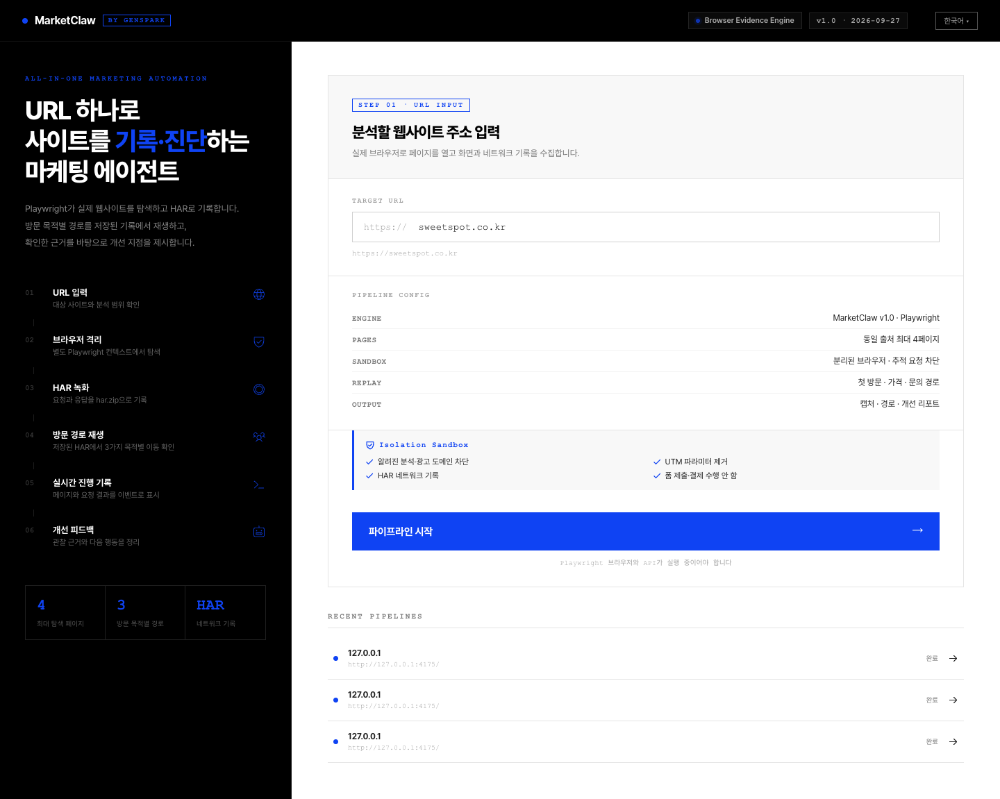
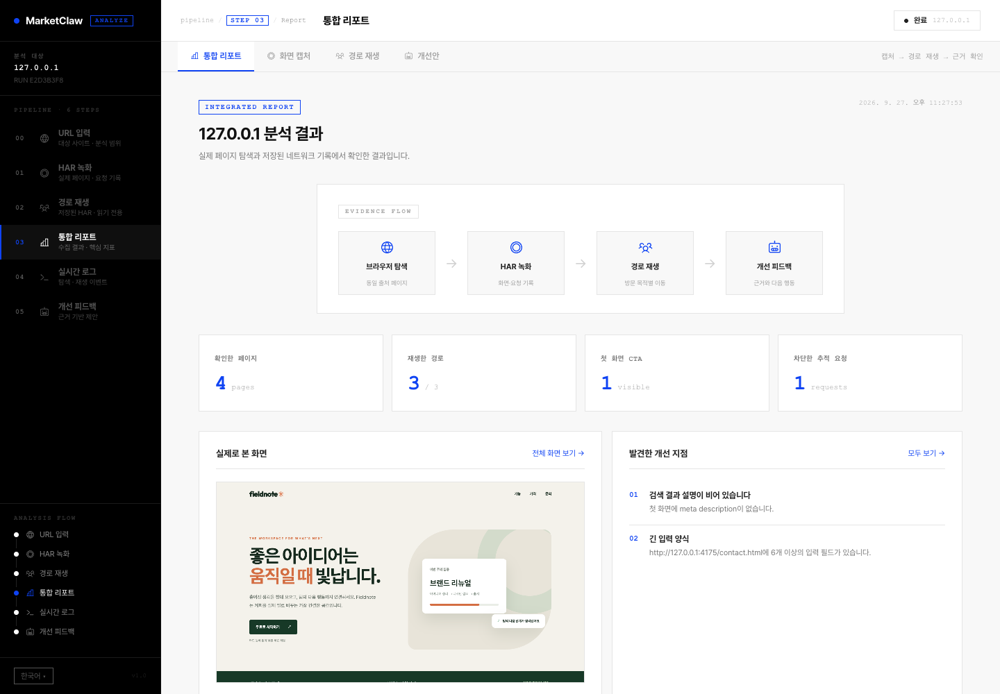
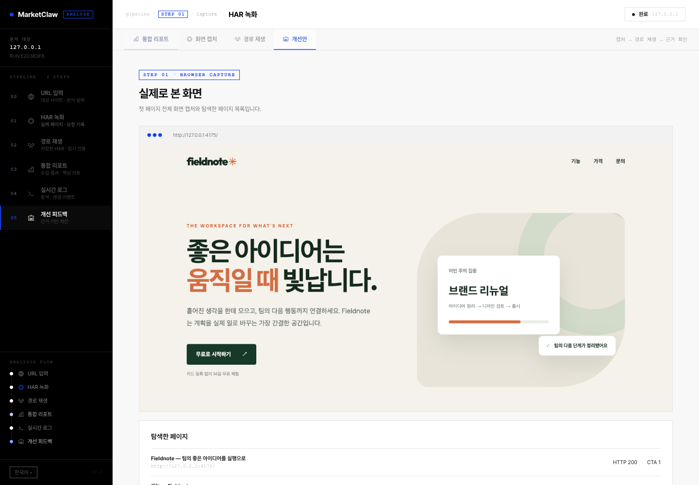
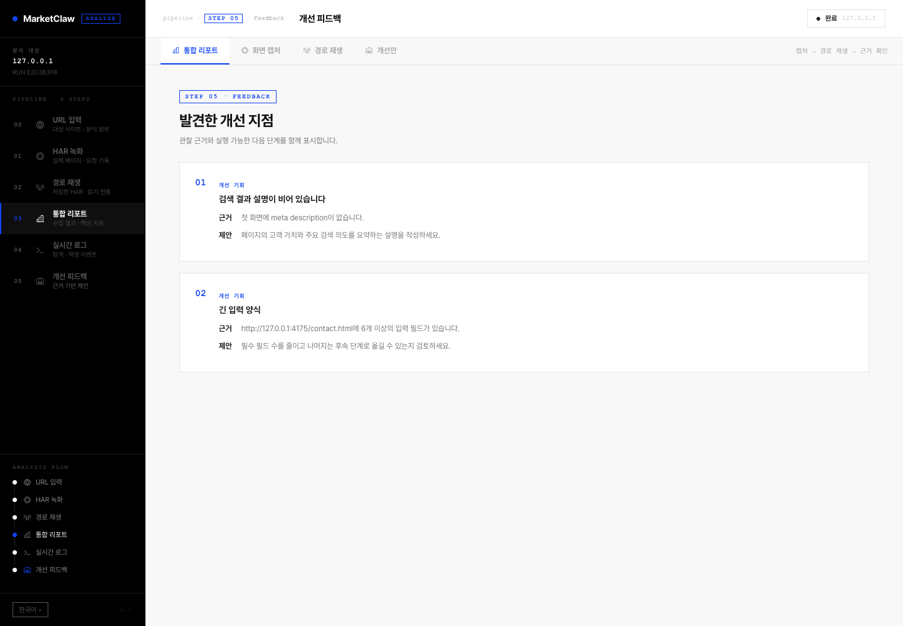
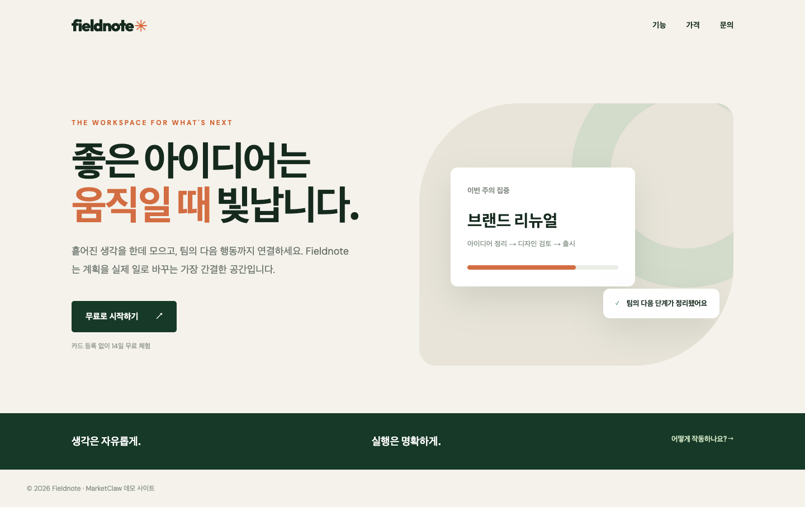
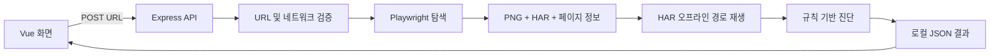

<div align="center">
  

  # MarketClaw

  **마케팅의 다음 선택, 추측 말고 증거로.**

  실제 웹사이트를 탐색하고, 저장된 네트워크 기록으로 방문자 경로를 재생해 개선 지점을 제시하는 오픈소스 로컬 웹 도구입니다.
</div>



## 무엇을 할 수 있나요?

MarketClaw는 URL 하나를 입력받아 다음 작업을 수행합니다.

1. **실제 브라우저로 사이트 탐색:** Playwright Chromium이 첫 페이지와 내부 링크를 따라 최대 4개 페이지를 엽니다. 각 페이지의 제목, 검색 결과 설명, H1/H2, 화면에 보이는 CTA, 링크, 양식 필드 수, HTTP 상태를 수집합니다.
2. **화면과 네트워크 기록 저장:** 첫 페이지의 전체 화면 PNG와 HAR 파일을 로컬 `data/runs/<분석 ID>/`에 저장합니다. 알려진 분석·광고 도메인 요청을 차단하고 URL의 일반적인 추적 파라미터를 제거합니다.
3. **방문자 목적별 경로 재생:** 첫 방문자, 가격 검토자, 문의 준비자가 첫 화면에서 찾을 수 있는 내부 링크를 선택합니다. 수집한 HAR을 이용해 네트워크 없이 페이지 이동 가능 여부를 확인합니다. 버튼을 눌러 폼을 제출하거나 구매하지 않습니다.
4. **근거 기반 리포트 작성:** 누락된 설명문/H1, 첫 화면 CTA 부재, 긴 양식, 오류 페이지와 요청 실패를 확인해 각 항목의 **근거와 제안**을 함께 표시합니다. 관찰한 사실 외의 전환율이나 매출 상승을 만들어 내지 않습니다.



위 리포트는 저장소에 포함된 Fieldnote 데모 사이트를 실제로 실행해 생성했습니다. 4개 페이지를 탐색했고 3개 경로를 HAR에서 재생했으며, 알려진 추적 요청 1개를 차단했습니다. 첫 페이지의 검색 결과 설명문 누락과 문의 양식의 필드 6개를 발견했습니다. 수치는 실행 환경과 사이트 변경에 따라 달라질 수 있습니다.

사이드바에서 **HAR 녹화**를 누르면 실제로 캡처한 화면과 페이지 목록을, **개선 피드백**을 누르면 각 진단의 근거와 제안을 볼 수 있습니다.





### 데모 사이트

저장소의 `demo-site/`는 제품의 동작을 재현하기 위한 예시 랜딩 페이지입니다. 홈, 기능, 가격, 문의 화면이 있으며 분석 요청 차단과 개선 항목을 검증할 수 있게 구성했습니다.



## 빠른 시작

**필요한 것:** Node.js 20 이상, npm, Chromium을 설치할 수 있는 환경. macOS에서 Google Chrome이 이미 있으면 `BROWSER_CHANNEL=chrome`을 사용할 수도 있습니다.

```bash
git clone https://github.com/yc9954/MarketClaw.git
cd MarketClaw
npm ci
npx playwright install chromium
cp .env.example .env
npm run dev
```

`http://127.0.0.1:3000`에서 화면을 열고 공개 웹사이트 URL을 입력합니다. API는 기본값으로 `http://127.0.0.1:4000`에서 실행됩니다. 두 서버를 한 명령으로 시작하며 종료하면 함께 종료됩니다.

### 포함된 데모로 처음 실행하기

`npm run dev:demo`를 실행한 뒤 화면에 `http://127.0.0.1:4175/`를 입력하면 위 리포트와 같은 분석을 수행합니다. 이 명령은 로컬 데모 사이트와 서버를 함께 시작하고 해당 프로세스에서만 사설 주소 분석을 허용합니다. 일반 사이트 분석은 `npm run dev`를 사용하세요. macOS/Linux 셸용 명령입니다.

### 빌드 및 단일 서버 실행

```bash
npm run build
npm start
```

빌드된 Vue 화면과 API를 한 Express 서버가 `http://127.0.0.1:4000`에서 제공합니다. `HOST`와 `PORT`는 `.env`에서 변경할 수 있습니다. 공개 네트워크에 바인딩할 때는 먼저 인증, 접근 제어, 요청 제한을 구성하세요.

### 검증

```bash
npm test
```

통합 테스트는 화면 빌드와 임시 데모 서버를 포함해 실제 브라우저 캡처 → HAR 재생 → 진단 → PNG 제공 → 홈에서 결과 열기까지 확인합니다. GitHub Actions도 같은 흐름을 실행합니다. Playwright가 설치한 Chromium을 사용하려면 `BROWSER_CHANNEL`을 비워 두세요.

## 화면과 지표 읽기

| 항목 | 의미 |
| --- | --- |
| 확인한 페이지 | 브라우저에서 열기를 시도한 동일 출처 페이지 수. 오류 페이지도 포함됩니다. |
| 재생한 경로 | 저장된 HAR에서 대상 링크로 실제 이동한 목적별 경로 수 / 시도한 경로 수. |
| 첫 화면 CTA | 초기 1440×900 뷰포트에 보인 행동 요소 수. 자동 판별이므로 탐색 메뉴와 구분이 완벽하지 않을 수 있습니다. |
| 차단한 추적 요청 | 사전에 정의한 분석·광고 도메인 목록에 일치한 요청 수. 모든 추적 기술의 포괄적 탐지는 아닙니다. |
| 발견한 개선 지점 | 수집된 페이지 속성과 오류를 규칙으로 평가한 결과. 실험의 우선순위를 정하는 출발점입니다. |

페이지 전체 화면 캡처와 리포트가 일치하는지 확인한 뒤 제안을 적용하세요. 경로 재생은 실제 사용자나 전환을 시뮬레이션하지 않으며, **폼 제출·결제·계정 생성은 수행하지 않습니다.**

## 구조

```text
MarketClaw/
├── server/
│   ├── src/
│   │   ├── index.js       # API, 작업 큐, 로컬 기록, 빌드 화면 제공
│   │   ├── browser.js     # URL 검증, 실시간 탐색, HAR 오프라인 재생
│   │   ├── analyze.js     # 관찰 신호를 개선 제안으로 변환
│   │   └── demo.js        # 데모 사이트 서버
│   └── test/              # 브라우저 통합 테스트
├── web/src/               # Vue 화면: URL 입력, 진행 상황, 결과 리포트
├── demo-site/             # 재현 가능한 예제 웹사이트
├── docs/assets/           # 마스코트 로고
├── docs/screenshots/      # 실제 실행 화면 캡처
├── data/runs/             # 로컬 분석 결과 (Git 제외)
└── .github/workflows/ci.yml
```



### API

| 요청 | 설명 |
| --- | --- |
| `GET /api/health` | 서비스 상태 |
| `POST /api/runs` | `{ "url": "https://example.com" }`으로 비동기 분석 생성. 분석 ID 반환. |
| `GET /api/runs` | 최신 순의 분석 목록 |
| `GET /api/runs/:id` | 진행 이벤트와 결과 조회 |
| `GET /api/runs/:id/screenshot` | 완료된 분석의 첫 페이지 PNG |

분석은 서버 프로세스에서 한 건씩 실행됩니다. 진행 중 서버가 재시작되면 해당 작업은 `interrupted`로 표시되며 새 분석을 시작할 수 있습니다. 결과와 HAR은 `data/runs/`에 남고 Git에는 포함되지 않습니다.

## 설정

| 변수 | 기본값 | 설명 |
| --- | --- | --- |
| `HOST` | `127.0.0.1` | API 수신 주소 |
| `PORT` | `4000` | API 및 빌드 화면 포트 |
| `BROWSER_CHANNEL` | 비어 있음 | Playwright 설치 Chromium 사용. `chrome`이면 설치된 Chrome 사용. |
| `MAX_PAGES` | `4` | 한 번에 탐색할 동일 출처 페이지 수. 최대 8. |
| `ALLOW_PRIVATE_TARGETS` | `0` | 로컬·사설망 URL 허용. 번들 데모 또는 테스트에만 사용. |
| `DATA_DIR` | `data/runs` | 분석 결과 저장 위치. |
| `DEMO_PORT` | `4175` | 번들 데모 사이트 포트. |

## 데이터와 운영 범위

- 기본적으로 API는 루프백 주소에만 바인딩됩니다. 인증 기능은 없으므로 공개 서버로 운영하려면 인증과 요청 제한을 추가해야 합니다.
- 입력 URL은 HTTP(S)만 허용하고, 기본 설정에서 로컬·사설망 주소를 차단합니다. 리다이렉트로 다른 출처로 이동하는 페이지 탐색도 차단합니다.
- HAR은 방문한 사이트의 응답 본문, URL, 경우에 따라 쿠키나 인증 관련 정보를 담을 수 있습니다. 개인 계정에 로그인한 브라우저를 공유하지는 않지만, `data/runs/`을 비공개로 관리하고 공개 저장소에 올리지 마세요.
- 실제 브라우저 렌더링이 필요하므로 JavaScript 오류, 봇 차단, 로그인 요구, 네트워크 상태에 따라 일부 페이지와 경로가 실패할 수 있습니다. 수집은 최대 4개 페이지(설정 가능)로 제한됩니다.
- 이 버전은 웹사이트 관찰과 개선 진단에 집중합니다. 방문자 수·전환율·매출 추정이나 실사용자 행동 분석 도구는 아닙니다.

## 출처와 라이선스

이 프로젝트는 기존 [MiroFish](https://github.com/666ghj/MiroFish) 기반 실험에서 출발해 작동 범위를 다시 설계한 MarketClaw입니다. 코드와 문서는 저장소의 [AGPL-3.0 라이선스](LICENSE)를 따릅니다. 가재 이미지는 이 프로젝트를 위해 생성한 일러스트이며, 이미지 안의 Genspark 명칭과 마크는 해당 서비스의 상표입니다. MarketClaw는 Genspark 또는 OpenClaw의 공식 제품이 아닙니다.
