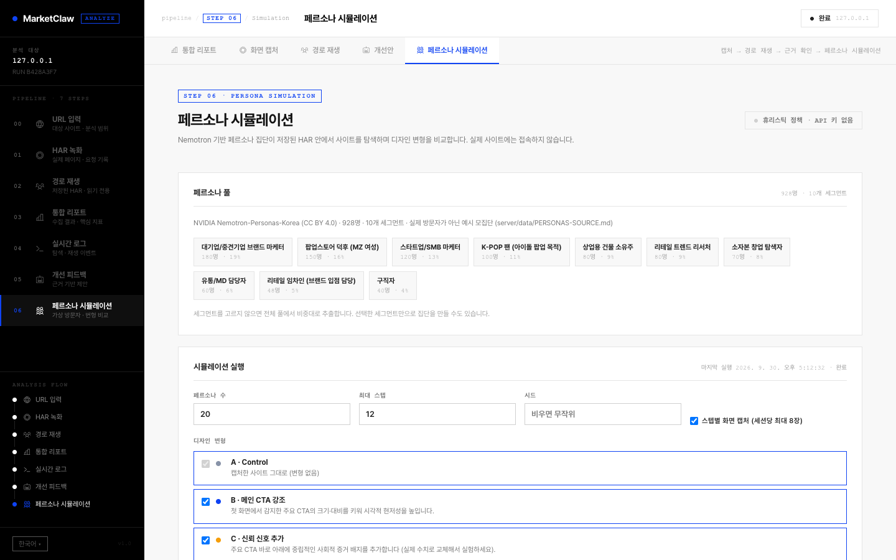
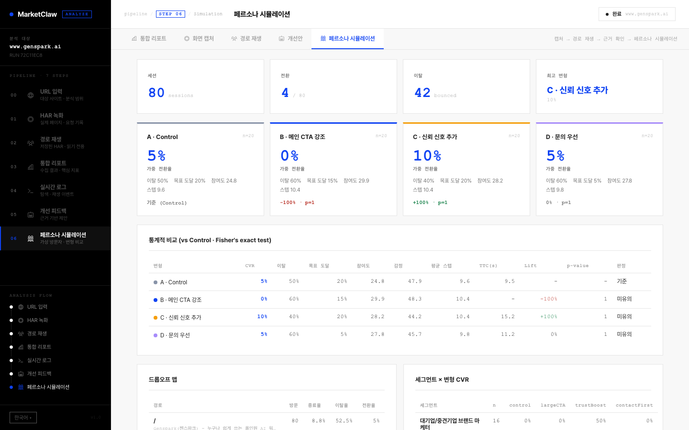
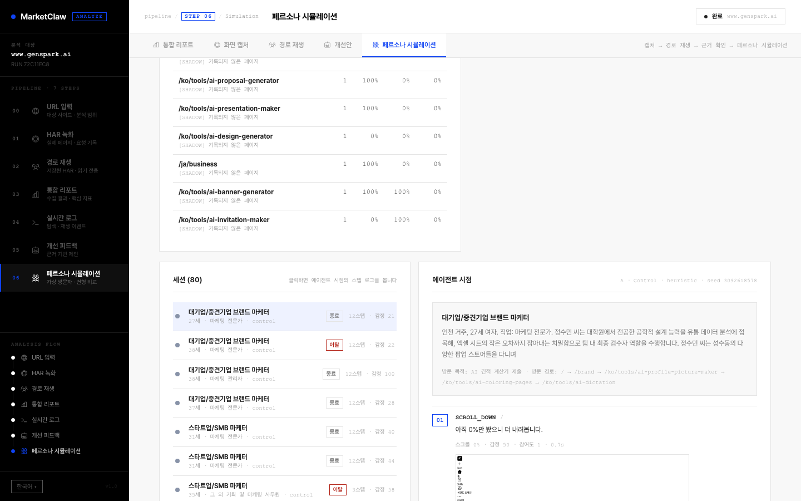

<p align="center">
  
</p>

<h1 align="center">MarketClaw</h1>

<p align="center">
  <a href="https://github.com/yc9954/MarketClaw/actions/workflows/ci.yml"></a>
  
  
  
  <a href="LICENSE"></a>
</p>

<p align="center">
  <strong>Make your next marketing decision with evidence, not guesses.</strong><br/>
  MarketClaw is a locally run web app that opens a real website in Playwright Chromium, records a HAR and a full-page<br/>
  screenshot, replays three visitor paths from that recording, and turns what it observed into a report of findings,<br/>
  each with the evidence behind it and a suggested next action. On top of that recording it can run a population of<br/>
  persona agents against design variants and compare them, clearly labelled as simulation, never as measurement.
</p>

<h3 align="center"><a href="#getting-started"><ins>Getting started</ins></a></h3>

<p align="center">
  
</p>

## Features

<table>
<tr>
<td width="50%" valign="middle">

### One report, four numbers, every finding traceable

The integrated report shows pages inspected, paths replayed, above-the-fold CTAs and tracking requests blocked, next to the landing page as the browser actually saw it and the list of improvement findings.

The report shown here came from a real run against the public [Genspark homepage](https://www.genspark.ai/) on 27 September 2026: four pages inspected, one primary interaction visible in the initial viewport, eight tracker requests blocked, and none of the three preset paths found a matching link in Genspark's workspace interface (0/3), which is not a problem with Genspark. Counts and page content change over time.

</td>
<td width="50%">
  
</td>
</tr>
<tr>
<td width="50%" valign="middle">

### Inspect pages in a real browser

Playwright Chromium opens the landing page at 1440 × 900 and follows same-origin links, up to four pages by default (eight at most). For each page it records the title, meta description, H1/H2 headings, visible calls to action or standalone prompt inputs, links, form field counts and the HTTP status.

The **HAR Capture** view shows the full-page PNG and the inventory of pages it visited.

</td>
<td width="50%">
  
</td>
</tr>
<tr>
<td width="50%" valign="middle">

### Findings with evidence and a next step

Rules in `analyze.js` flag a missing meta description or H1, no CTA in the initial viewport, pages that errored or returned 4xx/5xx, forms with more than five fields, and failed network requests. Each finding carries the observation that triggered it and one concrete action.

If nothing trips, the report says so, states how many pages were explored and how many preset paths reached their target, and suggests checking paths that match the site's real visit purposes.

</td>
<td width="50%">
  
</td>
</tr>
<tr>
<td width="50%" valign="middle">

### Persona simulation

The simulation stage grew out of the MiroFish-based prototype that preceded MarketClaw: a population of persona agents, a behaviour model per persona, parallel Playwright sessions and a variant dashboard with Fisher's exact test. It is now part of this repository, rewritten as ES modules under `server/src/simulation/` and generalized so it runs against **any captured site**, not one hard-coded target.

Details, endpoints and limits are in [Persona simulation](#persona-simulation) below.

</td>
<td width="50%">
  
</td>
</tr>
</table>

---

## Persona simulation

<p align="center">
  
</p>

<table>
<tr>
<td width="50%"></td>
<td width="50%"></td>
</tr>
<tr>
<td valign="top"><sub><strong>Setup.</strong> Segment chips show each segment's size and share; pick some to restrict the population or none to sample the whole pool by weight. The policy pill says whether an LLM key is configured. Control is always included.</sub></td>
<td valign="top"><sub><strong>Agent's-eye view.</strong> Every step records the action, its target, the page, the persona's reason, sentiment, engagement and simulated elapsed time, and optionally the viewport screenshot. Sessions are listed control first, then each variant in the order requested.</sub></td>
</tr>
</table>

**What happens when you press start**

1. **Population.** `personas.js` loads `server/data/personas.json` (928 personas in 10 segments, see [provenance](server/data/PERSONAS-SOURCE.md)) and draws `personas` of them: the count is split across the chosen segments in proportion to their weight, then a seeded shuffle picks inside each segment. The same `seed` always yields the same population.
2. **Variants.** `variants.js` turns each variant into DOM patches (`css`, `text`, `hide`, `inject`, `reorder`) that are applied after every page load. The four defaults are generic and bind to the run's own inventory: `control`, `largeCTA` (enlarges the primary above-the-fold CTA the capture detected), `trustBoost` (a neutral social-proof badge under that CTA, a placeholder you are meant to replace with a real claim), `contactFirst` (a contact bar at the top linking to the contact page found in the capture). Custom variants can be posted as `{ key, name, patches }`; selectors, text and HTML are length-capped and scripts or inline handlers are rejected.
3. **Shadow browser.** `shadow.js` opens one Playwright context per session and routes it from the run's `capture.har.zip`. Anything the HAR does not contain is answered locally: tracker hosts and foreign origins are aborted, `POST`/`PUT`/`PATCH` to the target origin get a mock `{ ok: true }`, unrecorded documents get a placeholder page. **The live site is never contacted.** An init script intercepts `dataLayer`, `gtag` and `fbq` and records clicks and form submits.
4. **Agents.** `engine.js` observes the page (text, links, buttons, inputs, social proof) and scores every element's visual salience from fold position, F-pattern quadrant, hierarchy, contrast, Fitts's law, Hick's law and Gestalt cues. The persona then picks one action from a four-layer taxonomy (navigation, DOM, micro-signals like `read`/`dwell`, intent like `bounce`/`save_intent`), and memory tracks sentiment, engagement and information scent per step.
5. **Goals.** A page counts as a goal page when its path or title matches `contact|pricing|price|plans|signup|estimate|quote|demo|문의|견적|가입|상담|요금|가격|구독|신청`, or the request's own `goals` patterns. A session **converts** when it submits a form or clicks a CTA while already on a goal page; merely reaching a goal page counts as "goal reached", which the report shows separately.
6. **Report.** `report.js` aggregates weighted conversion and bounce (persona weights), engagement, steps, time-to-convert, a drop-off map per path, Fisher's exact test of each variant against control with relative lift, a segment × variant table, and a small peer-propagation model that estimates a K-factor per variant.

**Decision policy**

| Policy | When | Behaviour |
| --- | --- | --- |
| `heuristic` | default, no key needed | Weighted choice over the observed elements: CTA response, patience, copy importance, price consciousness and social-proof sensitivity from the persona, salience from the page, a commitment gate driven by sentiment. Seeded, so a run is reproducible from `seed`. Used in CI. |
| `llm` | `LLM_API_KEY` is set | Each step asks an OpenAI-compatible chat-completions endpoint (`LLM_BASE_URL`, `LLM_MODEL`) for one JSON action, with the persona, its cognitive profile and the captured page list in the system prompt. A failed call falls back to the heuristic for that step and marks it. |

The policy that ran is stored in every session and in `GET /api/runs/:id/simulation`.

**API**

| Request | Description |
| --- | --- |
| `GET /api/personas` | Pool summary (segments with counts and weights, sample personas), default variants, limits and LLM status. |
| `POST /api/runs/:id/simulation` | Start a simulation for a completed run. Body: `personas` (1–200, default 20), `segments`, `variants` (keys or custom objects), `goals` (path patterns), `concurrency` (1–6), `maxSteps` (2–30), `captureSteps`, `seed`, `policy: "heuristic"` to force the key-free policy. `409` if the run is not completed or a simulation is already running. |
| `GET /api/runs/:id/simulation` | `status`, `progress { done, total, failed }`, `policy`, `params`, `site`, `report` and session summaries. |
| `GET /api/runs/:id/simulation/sessions/:sid` | One session's full step log, memory, shadow events and network stats. |
| `GET /api/runs/:id/simulation/sessions/:sid/steps/:n.png` | The viewport at step `n` when `captureSteps` was on (up to 8 per session). |

Simulations share the API's one-job-at-a-time queue with captures. Results are written to `data/runs/<id>/simulation/` (`sessions/*.json`, `screenshots/<session>/step_NN.png`, `report.json`) and `simulation.json`, so they survive a restart; a simulation interrupted by a restart is marked `interrupted`.

**Limits, stated plainly**

- **Simulated, not measured.** Every conversion rate, bounce rate, lift and p-value describes what persona agents did inside a recording. They are inputs to the next experiment, not evidence about real visitors.
- **The pool is illustrative.** It was sampled from NVIDIA's Nemotron-Personas-Korea for a Korean B2B pop-up-store agency site; the segments, weights, interest keywords and conversion goals are editorial. Bring your own pool with `PERSONA_POOL_PATH` for a different audience.
- **Only the recording exists.** Agents can only visit pages the capture recorded (up to `MAX_PAGES`); other links open a placeholder. Form posts are mocked. JavaScript-heavy sites replay only as well as their HAR does.
- **The heuristic policy is a model of attention, not of people.** It reacts to salience, keywords and a few persona traits. Small populations produce wide swings; Fisher's test reports that honestly with high p-values.

---

## How it works

```text
Vue UI (web/) ──POST /api/runs──▶ Express API (server/src/index.js)
                                     │  one run at a time, progress events per run
                                     ▼
                              browser.js
                                ├─ URL + private-network validation
                                ├─ Playwright Chromium (headless by default), 1440×900, recordHar, tracker routes blocked
                                ├─ landing page + same-origin crawl (MAX_PAGES)
                                ├─ full-page PNG + HAR → data/runs/<id>/
                                └─ offline replay of 3 visitor paths from the HAR
                                     ▼
                              analyze.js  ── rule-based findings ──▶ JSON result ──▶ GET /api/runs/:id ──▶ report view
                                     │
                     POST /api/runs/:id/simulation (same queue)
                                     ▼
                              simulation/runner.js
                                ├─ personas.js: seeded, weight-stratified sample of the pool
                                ├─ shadow.js: one context per session, routed from capture.har.zip only
                                ├─ variants.js: DOM patches per variant, bound to the run's CTA/contact link
                                ├─ engine.js: observe → decide (heuristic | llm) → act → memory, per step
                                └─ report.js: weighted CVR/BR, Fisher's exact, drop-off, segments, K-factor
```

1. **Submit.** The home screen posts `{ "url": "https://example.com" }`. Only HTTP(S) URLs are accepted; local and private-network targets are rejected unless `ALLOW_PRIVATE_TARGETS=1`, and cross-origin redirects are treated as errors.
2. **Capture.** A separate browser context (never your signed-in browser) records a HAR with embedded content, blocks known tracking hosts, and inspects the landing page plus same-origin links.
3. **Replay.** A second context replays the three purpose-driven paths from the HAR, counting which ones reached their target.
4. **Analyze and store.** `analyze.js` turns page properties, network failures and replay results into findings. The result is written to `data/runs/` and streamed to the UI as progress events.

| Request | Description |
| --- | --- |
| `GET /api/health` | Service health. |
| `POST /api/runs` | Start an asynchronous run; returns a run id. |
| `GET /api/runs` | List runs, newest first. |
| `GET /api/runs/:id` | Progress events and the report. |
| `GET /api/runs/:id/screenshot` | The landing-page PNG of a completed run. |
| `GET /api/personas` | Persona pool summary, default variants and LLM status. |
| `POST /api/runs/:id/simulation` | Start a persona simulation on a completed run. |
| `GET /api/runs/:id/simulation` | Simulation status, progress, report and session summaries. |
| `GET /api/runs/:id/simulation/sessions/:sid` | Full step log of one session. |
| `GET /api/runs/:id/simulation/sessions/:sid/steps/:n.png` | Viewport screenshot at step `n`. |

If the server restarts mid-run, that run is marked `interrupted`; start a new one. The same applies to a simulation.

---

## Tech stack

<p>
  <kbd>Vue&nbsp;3.5</kbd> &nbsp; <kbd>vue-router&nbsp;4</kbd> &nbsp; <kbd>Vite&nbsp;7</kbd> &nbsp; <kbd>Phosphor&nbsp;icons</kbd> &nbsp;
  <kbd>Node&nbsp;≥&nbsp;20</kbd> &nbsp; <kbd>Express&nbsp;4</kbd> &nbsp; <kbd>Playwright&nbsp;1.58</kbd> &nbsp; <kbd>dotenv</kbd> &nbsp; <kbd>npm&nbsp;workspaces</kbd> &nbsp; <kbd>node:test</kbd>
</p>

---

## Getting started

**Prerequisites**

- Node.js 20 or newer and npm.
- An environment where Playwright can install Chromium. On macOS you may set `BROWSER_CHANNEL=chrome` to use an installed Google Chrome instead.

```bash
git clone https://github.com/yc9954/MarketClaw.git
cd MarketClaw
npm ci
npx playwright install chromium
cp .env.example .env
npm run dev            # Vue dev server on :3000 + API on :4000, stopped together
```

Open <http://127.0.0.1:3000> and enter a public website URL.

**Analyze a site that blocks headless browsers.** Genspark's security checks may reject an automated headless browser; the screenshots above were captured on macOS with an installed Chrome in visible mode:

```bash
BROWSER_CHANNEL=chrome BROWSER_HEADLESS=0 PAGE_SETTLE_MS=5000 npm run dev
```

A Chrome window opens while the run is active. Site security checks and the visible page can vary by machine and session.

**Try the local fixture:** `npm run dev:demo` starts `demo-site/` as well and allows private-network targets for that process; then enter `http://127.0.0.1:4175/` in the app. (Both commands use macOS/Linux shell syntax.)

**Single-server build:**

```bash
npm run build          # vite build → web/dist
npm start              # Express serves the built UI and the API on :4000
```

| Process | Port | Notes |
| --- | --- | --- |
| Vue dev server (`npm run dev -w web`) | `3000` | bound to `127.0.0.1` |
| Express API + built UI (`npm start`) | `4000` | `HOST` / `PORT` |
| Bundled demo site (`npm run demo:site`) | `4175` | `DEMO_PORT` |

| Variable | Default | Purpose |
| --- | --- | --- |
| `HOST` | `127.0.0.1` | API bind address. |
| `PORT` | `4000` | API and built-UI port. |
| `BROWSER_CHANNEL` | empty | Empty uses Playwright's Chromium; `chrome` uses installed Google Chrome. |
| `BROWSER_HEADLESS` | `1` | Set to `0` to open a visible browser window during the run. |
| `PAGE_SETTLE_MS` | `750` | Wait after `domcontentloaded` before extracting a page (0–10000). |
| `MAX_PAGES` | `4` | Same-origin pages inspected per run; capped at 8. |
| `ALLOW_PRIVATE_TARGETS` | `0` | Allow local and private-network URLs. Only for the local fixture and tests. |
| `DATA_DIR` | `data/runs` | Where run results are written. |
| `DEMO_PORT` | `4175` | Bundled demo-site port. |
| `LLM_API_KEY` | empty | Enables the `llm` decision policy for simulations. Empty means the heuristic policy. |
| `LLM_BASE_URL` | `https://api.openai.com/v1` | OpenAI-compatible chat-completions base URL (OpenAI, OpenRouter, a local server). |
| `LLM_MODEL` | `gpt-4o-mini` | Model name sent to that endpoint. |
| `SIM_CONCURRENCY` | `3` | Parallel browser sessions per simulation (1–6). |
| `SIM_MAX_STEPS` | `12` | Steps per session (2–30). |
| `PERSONA_POOL_PATH` | empty | Path to a custom persona pool JSON; empty uses `server/data/personas.json`. |

---

## Building and testing

```bash
npm test               # builds the UI, then node --test server/test/*.test.js
```

`integration.test.js` starts a local fixture server from `demo-site/` and checks real browser capture, HAR replay, findings, PNG delivery, opening a result from the home screen, and the visual layout. `simulation.test.js` unit-tests Fisher's exact test against known tables, weighted conversion, seeded persona sampling, variant patches on a static page and goal detection, then captures the demo site and runs a 3-persona × 2-variant simulation through the API with the heuristic policy, checking sessions, report, screenshots, reproducibility of the seed and the simulation tab in the UI. No API key is needed. [`.github/workflows/ci.yml`](.github/workflows/ci.yml) runs both on Node 22 with `BROWSER_CHANNEL=chromium`.

---

## Reading the report

| Metric | Meaning |
| --- | --- |
| Pages inspected | Same-origin pages the browser attempted to open, including ones that returned errors. |
| Paths replayed | Visitor-purpose paths that reached their target from the HAR, out of all attempted. |
| Above-the-fold CTAs | Action elements or standalone prompt inputs visible in the initial 1440 × 900 viewport. Heuristic; may not perfectly separate CTAs from navigation. |
| Tracking requests blocked | Requests matching the built-in analytics/advertising domain list. Not comprehensive tracker detection. |
| Improvement findings | Rule-based checks of captured page properties and errors, meant to guide the next experiment. |
| Weighted CVR / bounce (simulation) | Share of persona weight that converted or bounced per variant. Simulated agents, not visitors. |
| Lift, p-value (simulation) | Relative change of weighted CVR against control and the two-sided Fisher's exact p-value on raw counts. |
| Goal reached (simulation) | Share of sessions that opened a goal page at all; conversion additionally requires a form submit or a CTA click on that page. |

Check the captured page against the report before acting on a recommendation.

---

## Repository structure

| Path | What lives there |
| --- | --- |
| `server/src/index.js` | Express API, in-memory job queue (one run at a time), local storage under `data/runs/`, static serving of the built UI. |
| `server/src/browser.js` | URL checks, Playwright capture (HAR, PNG, page inventory, tracker blocking), offline HAR path replay. |
| `server/src/analyze.js` | The finding rules. |
| `server/src/demo.js` | Static server for the bundled demo site. |
| `server/src/simulation/` | Persona simulation: `personas.js` (pool, seeded sampling), `variants.js` (patch engine, default variants, validation), `shadow.js` (HAR-only browser context), `engine.js` (observation, salience, actions, memory, goals, heuristic and LLM policies), `runner.js` (personas × variants with concurrency, session files, screenshots), `report.js` (aggregation, Fisher's exact test, drop-off, segments, propagation), `random.js` (seeded PRNG). |
| `server/data/personas.json`, `server/data/PERSONAS-SOURCE.md` | The bundled persona pool and where it came from. |
| `server/test/integration.test.js`, `server/test/simulation.test.js` | End-to-end test against the demo site; unit and API tests for the simulation. |
| `web/src/` | Vue app: `views/Home.vue` (URL input, pipeline, recent runs), `views/Report.vue` (report, capture, replay, feedback, simulation tabs) and `views/Simulation.vue` (pool, run form, results, agent's-eye session view). |
| `demo-site/` | Local fixture for the integration test: `index`, `features`, `pricing`, `contact`. |
| `docs/screenshots/`, `docs/assets/` | Screenshots from an actual Genspark run and from a demo-site simulation; `legacy/` keeps captures of the pre-MarketClaw prototype; the mascot artwork. |
| `data/runs/` | Local run results (git-ignored). |
| `.env.example`, `.github/workflows/ci.yml` | Configuration defaults and CI. |

---

## Project status

**Working today.** Everything above: capture, tracker blocking, HAR replay of three paths, rule-based findings, PNG/HAR/JSON storage, run history, the Korean UI, the persona simulation with its heuristic and LLM policies, and CI-backed integration tests. Version 1.1.0.

**Security posture.** The API binds to loopback and has no authentication, rate limiting or access control; add those before exposing it beyond your machine. A HAR can contain response bodies, URLs and sometimes cookies or authorization data from the visited site. MarketClaw uses its own browser context, not your signed-in browser, but keep `data/runs/` private and never commit it.

**Known limitations.** JavaScript errors, bot protection, login walls and network conditions can make pages or replay paths fail; some sites only load in a visible (`BROWSER_HEADLESS=0`) installed Chrome. CTA and tracker detection are heuristics. The server processes a single job (capture or simulation) at a time; on start it reloads previous runs from `data/runs/` and marks any that were in progress as `interrupted`. Simulations only see the pages the capture recorded, their persona pool is illustrative, and their results are simulated (see [Persona simulation](#persona-simulation)).

**Out of scope.** Real-user behaviour, visitor counts, conversion rates or revenue. MarketClaw observes a site and suggests the next experiment; the persona simulation compares design variants under a model of visitors, and its numbers must not be read as measurements.

---

## Credits and license

MarketClaw grew out of an experiment based on [MiroFish](https://github.com/666ghj/MiroFish), with a redesigned scope and implementation. The persona pool is derived from [NVIDIA Nemotron-Personas-Korea](https://huggingface.co/datasets/nvidia/Nemotron-Personas-Korea) (CC BY 4.0); see [`server/data/PERSONAS-SOURCE.md`](server/data/PERSONAS-SOURCE.md). The lobster illustration was created for this project; the Genspark name and mark shown in it belong to their respective owner, and MarketClaw is not an official Genspark or OpenClaw product.

Code and documentation are distributed under the [AGPL-3.0](LICENSE).
